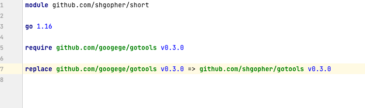
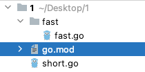
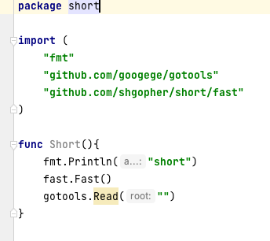
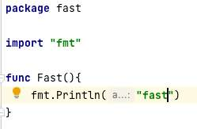

# go语言包管理工具 go mod 详细介绍

通常来说我们创建某个项目都是直接使用IDE来进行创建，当然了使用vs code这种文本编辑器也可以，所以说使用这些工具来创建一个go的开发环境，是几乎不需要设置的，因为ide已经帮你设置好了，我们就拿goland来说，当我们选择新建一个go项目的时候，go.mod和go.sum都会自动创建完成，说到这里我们就要提一下这两个文件了。

`go.mod` :

通常你会见到这样的格式

```go
module github.com/shgopher/short

go 1.16

require(

github.com/gin-contrib/sse v0.0.0-20190124093953-61b50c2ef482
github.com/golang/protobuf v1.2.0

)
```
> go.sum是系统自动管理的文件，用户禁止直接操作，就不谈了。作用就是记录使用的每一个包以及它的版本。

首先呢，每一个go.mod对应了一个项目，每个项目里都有一个go.mod，最上面是一个module字符，后面加上你的包名称，我这里的包名称就是 `github.com/shgopher/short` 这一堆东西就是这个包的路径，注意是路径并不是包的名称，下文会详细说。

下面的`go1.16`代表了本项目使用的go的版本。

下面的两行都是指的这个项目中使用到的外部包（除了标准库以外的包），前面是名称，后面是它的版本号，上面这种形式，就是所谓的发布的时候没有采用git version的方式进行发布，所以go自动将发布时候的时间作为了它的版本号，下面这个项目，由于发布的时候使用了 git version，拥有了一个版本号，所以我们使用的时候就直接使用`v1.2.0`这个版本号即可。

这里要介绍一下包的命名问题，为什么我们的包名称里面要有github呢？原因也很简单，你没有这个也可以，没有规定一定要有，只是go使用git来管理包的版本，然后呢，大多数的程序员使用GitHub来管理自己的代码，所以说发布到GitHub上以后的包被go引用就是GitHub开头了，举个例子，假设我的仓库在GitHub上，地址是，`github.com/shgopher/short`，我们在项目中使用这个包（通常在项目中这个包就是被命名为“github.com/shgopher/short”）然后go就会自动下载这个包，使用的原理就是 `git clone https://github.com/shgopher/short` 也就是说go把`https://` 给你省略了,当然ide是可以自动帮你下载包的。

那么如果ide反应迟钝，或则是因为网络问题，我们该如何下载这个包到本地呢？

通常来说，我们将这个包写入了`import()`里面，然后我们在命令行里，输入`go mod tidy` go就可以自动将远程包下载到本地了。

说到这里，我们还得注意一件事，go是存在子包的，举个例子：

比如这个项目叫做`github.com/shgopher/short`，那么这个项目中存在若干子包，比如可以叫做`github.com/shgopher/short/fast` 这个就是short的子包，通常就是一个子文件夹，里面是另一个包名即可。

我们要注意一点，`github.com/shgopher/short`，只有最后这个单词才是包的正式名称，这一个整串儿其实只是路径而已，就比方这个项目，package一定是`short`而不是那一串儿，这个时候又来了一个问题，那么这个包的名字跟这个路径的名字不一样行不？答案是可以的，比如说这个包的名称是short，那么这个路径完全可以命名为 `github.com/shgopher/babalala` 但是通常我们都是保持一致的，所以说判断一个包的名称具体是啥，不是看module后面的路径，而是看包内部package后面的名称。

关于子包的使用，我们可以给定一个场景，比如说我们的项目，和要使用的外部包都被托管于GitHub，那么我们的包叫做 example，路径是 `github.com/shgopher/example`那么我们要使用的外部包有short包和short/fast包，那么我们该如何使用呢？

```go
package example

import(
    "github.com/shgopher/short"
    "github.com/shgopher/short/fast"
)
```

如何自己的项目中拥有子包，大包要调用子包该如何调用呢？其实这个场景也很常见，因为你搞子包的很大意义就是它自己的功能性自成一体，然后大包要使用这个功能，其实这个也很简单，直接调用即可。

假设这个子包叫做fast

```go
package example

import(
    "github.com/shgopher/example/fast"
)
```

大的版本升级，go也是不一样的，通常按照规则，一个项目还比如short吧，它原本的仓库是`module github.com/shgopher/short`，如果版本已经上升到了大于等于2的地步，go的推荐是包的命名要改为`module github.com/shgopher/short/v2`但是包的名称还是short，并不是v2，也就是说package这里还是short，只是在module这里改成了这种写法，那么别的包使用这个包的时候该如何使用呢

```go
import(
"github.com/shgopher/short/v2"
)
```
记得版本一定是v+数字，例如`v2，v3，v4，v5`。
在下面使用的时候仍然是用的`short.xxx`
感觉有点麻烦对吧，就是这么用的，记得就行。

如果你的包引入的外部包不够好，你想重构怎么办？这个时候就靠replace命令出手了

go.mod:

```go
module github.com/shgopher/short

replace(

    github.com/shgoper/i v0.1.0 => github.com/shgopher/newShort v0.3.0
)

```
这里就是说我们项目中原本使用的是v0.1.0这个版本的i包，但是我们不想改代码，我们实际上使用的v0.3.0 版本的newshort包。

到这里了，我们再回忆一下重点知识，go的每个项目其实就是以包为单位的，包可以拥有子包，只有main包可以拥有main函数，以及只有main函数才可以执行，才能直接生成可执行文件。module后面跟的其实只是包的路径而已，通常我们命名为`github.com/xxx`是因为包部署到github,如果你把包放在了gitlab上，你可以改成`gitlab/xxx`也是没有问题的。

最后我把项目中演示的图片放到最后，不过由于网络问题你不一定能看得到。







