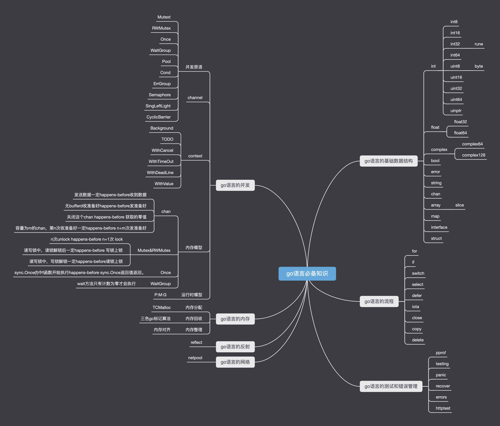

🔥 大厂 BAT 面试高频知识点，后端技术体系。包含了 [GO](#go语言的基本语法) , [网络](#作者的计算机知识项目)，[Redis](#作者的计算机知识项目) ，[MySQL](#作者的计算机知识项目) ，[消息队列](#作者的计算机知识项目) ，[高并发](#作者的计算机知识项目)，[微服务](#作者的计算机知识项目)，[缓存](#作者的计算机知识项目)，[操作系统](#作者的计算机知识项目)，[算法](#作者的计算机知识项目)，[LeetCode刷题](#作者的计算机知识项目) 等知识

# go语言从入门到熟练掌握

作者@[科科人神](https://github.com/shgopher/shgopher)

## 导图
> 国内访问可能无法访问到图片，可以添加微信公众号：`科科人神`，回复：`go思维导图` 获取**高清大图**，另外回复 `go-book` 可获得本教程的**PDF离线版本**。

>在线阅读[地址](https://shgopher.github.io/GOFamily)

## go语言的基本语法

- [介绍go语言](./1/description-go.md)
- [go语言的包管理工具](./1/gomod.md)
- [go语言的基础组件](./1/int.md)
- [go语言常用关键字](./1/for.md)
- [go语言的条件和逻辑语句](./1/if.md)
- [go语言的面向对象](./1/oop.md)
- [go语言的错误处理](./1/error.md)
- [go语言的测试](./1/testing.md)
## go语言高级用法
### 并发相关
- [同步原语和锁](./2/mutex.md)
- [context](./2/context.md)
- [channel](./2/channel.md)
- [定时器](./2/timer.md)
- [运行时调度器G:M:P](./2/gmp.md)      
- [网络轮询器netpool](./2/netpool.md)
- [系统监控](./2/system-control.md)
- [go语言的内存模型](./2/happens-before.md)
- [go语言的并发模型](./2/csp.md)
### 内存管理相关
- [内存分配](./2/tcmolloc.md)
- [内存回收gc](./2/gc.md)  
- [栈内存管理](./2/stack-mem.md)
### 工程相关
- [go语言的动态调试](./2/d-debug.md)
- [go语言的性能优化](./2/better.md)
- [cgo，unsafe非常见的操作能力](./2/cgo.md)
- [go语言的反射](./2/reflect.md)
- [go语言线上事故排查](./2/accident.md)
## go语言编程模式
- 
## Q&A
- 
## 附录：go语言的标准库的简要用法
- [net](./5/net.md)
- [http](./5/http.md)
- [rpc](./5/rpc.md)
- [time](./5/time.md)
- [io](./5/io.md)
- [bufio](./5/bufio.md)
- [container](./5/container.md)
- [sql](./5/sql.md)
- [crypto](./5/crypto.md)
- [encoding](./5/encoding.md)
- [flag](./5/flag.md)
- [fmt](./5/fmt.md)
- [os](./5/os.md)
- [syscall](./5/syscall.md)
- [text](./5/text.md)
- [strconv](./5/strconv.md)
- [sort](./5/sort.md)
- [strings](./5/strings.md)
- [atom](./5/atom.md)
- [log](./5/log.md)
- [json](./5/json.md)
## 作者的计算机知识项目
- [foo-lon](https://github.com/shgopher/foo-lon) : 系统设计以及分布式协议
- [GOFamily](https://github.com/shgopher/GOFamily) :go语言从入门到熟练掌握 
- [408Family](https://github.com/shgopher/408Family) : 算法和数据结构,设计模式，正则表达式，网络，操作系统，计算机组成原理
- [DBFamily](https://github.com/shgopher/DBFamily) : 从零开始学习数据库知识
- [study-k8s-docker](https://github.com/shgopher/study-k8s-docker) : 从零开始学习k8s和docker等容器化的知识
- [hi-test](https://github.com/shgopher/hi-test) :从零开始学习关于软件测试，性能测试，软件工程的知识
- [up](https://github.com/shgopher/up) : 从初级程序员向高级程序员迈进 --- 系统调优公开课
- [repairman](https://github.com/shgopher/repairman) :程序员的必修课 --- 线上紧急故障排除
- [Refactor](https://github.com/shgopher/refactor) : 高级软件工程师的必修课 -- 如何进行代码重构
- [coder](https://github.com/shgopher/coder) : 关注程序员的职业发展，会分享比如如何升迁，如何面试，如何赚钱等知识。

    
## 关注我

- 头条@[科科人神](https://www.toutiao.com/c/user/token/MS4wLjABAAAAIGeO1-kCUelF-G8GW3AvJlrEL7tiO24WHJmnX4nV1bs/)

- 微信公众号@科科人神

- b站@[科科人神](https://space.bilibili.com/478621088)

## star

