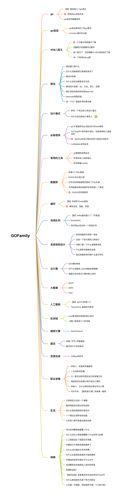

hey~，我是科科人神，目前就职于国内一家互联网公司，你们可以加我<a href="#wechat.png">微信</a>，交个朋友吧~

 

添加微信公众号：<a href="#wechat.png">科科人神</a>, 回复：
- `面试题`, 获取经典go面试大全。

- `好友`, 可以添加作者的微信好友

                             
## 系列教程
- [x] [GOFamily](https://github.com/shgopher/GOFamily/) 一本为go后端程序员打造的教程
- [ ] [408](https://github.com/shgopher/408/) 一本主要以408知识为主的基础课程
- [ ] [luban](https://github.com/shgopher/luban/) 一本用鲁班的名字命名，主要讲解系统设计的书籍
- [ ] [dingdang](https://github.com/shgopher/dingdang/) 叮当，是一本讲解各种工具的书
- [ ] [god](https://github.com/shgopher/god/) 给程序员写的教程，主要关于学习，副业，买房，面试等内容，程序员才是真神！
## 推荐项目
- [ ] [hui](https://github.com/shgopher/hui) 一个简洁好用效率高的web框架
- [ ] [key](https://github.com/shgopher/key) 一个服务授权系统
- [x] [short](https://github.com/shgopher/short) 一个简单的短链接服务
- [ ] [go-short](https://github.com/shgopher/go-short) 一个微服务架构的短链接服务
- [ ] [ka](https://github.com/shgopher/ka) 一个效率非常高的秒杀服务                             
## 基础
- [变量声明](./基础/变量声明)
- [常量声明](./基础/常量声明)
- [零值](./基础/零值)
- [复合字面量](./基础/复合字面量)
- [数字类型](./基础/数字类型)
- [slice](./基础/slice)
- [string](./基础/string)
- [map](./基础/map)
- [函数方法](./基础/函数方法)
- [interface](./基础/interface)
- [逻辑和判断语句](./基础/逻辑和判断语句)
- [关键字](./基础/关键字)
- [泛型](./基础/泛型)
- [其他内容](./基础/其他内容)
## 并发
- [并发原语](./并发/并发原语)
- [channel](./并发/channel)
- [atomic](./并发/atomic)
- [context](./并发/context)
- [并发模型](./并发/并发模型)
- [内存模型](./并发/内存模型)
## runtime
- [三色gc算法](./runtime/三色gc算法)
- [堆内存分配](./runtime/堆内存分配)
- [栈内存管理](./runtime/栈内存管理)
- [系统监控](./runtime/系统监控)
- [G:M:P](./runtime/gmp)
- [定时器](./runtime/定时器)
- [netpool](./runtime/netpool)
## 工程
- [测试](./工程/测试)
- [性能剖析](./工程/性能剖析)
- [包管理工具](./工程/包管理工具)
- [动态调试](./工程/动态调试)
- [错误处理](./工程/错误处理)
- [cgo](./工程/cgo)
- [go lint](./工程/golint)
- [反射](./工程/反射)
- [web](./工程/web)
- [wasm](./工程/wasm)
- [命令](./工程/命令)
- [优秀第三方包](./工程/优秀第三方包)
- [go标准库](./工程/go标准库)
- [go项目组织形式](./工程/项目组织形式)
- [go命名惯例](./工程/go命名惯例)

## 参考资料
- [go.dev](https://go.dev)
- [the go programming language](https://www.gopl.io/)
- [GO 语言精进之路](https://book.douban.com/subject/35720729/)
- [Go 语言设计与实现](https://draveness.me/golang/)
- [Go 语言编程模式实战](https://time.geekbang.org/opencourse/intro/100069501)
- [Go 并发编程实战课](https://time.geekbang.org/column/intro/100061801)
- [Go 语言项目开发实战](https://time.geekbang.org/column/intro/100079601)
- [Go 语言核心 36 讲](https://time.geekbang.org/column/intro/100013101)
- [手把手带你写一个 Web 框架](https://time.geekbang.org/column/intro/100090601)

## 扫一扫添加我的公众号，回复 “加群”，可以加入微信群。

 
 

                                                                             
## star
                                                                             

