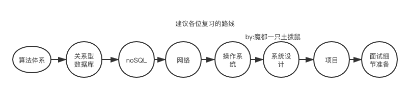
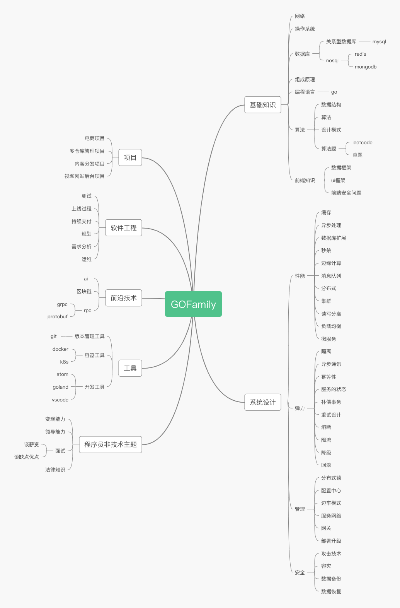

# GOFamily
大厂 bat 面试高频知识点，go语言后端体系。
## 概括

 

 
## HERE
|项目|介绍|
|:---:|:---:|
|对我的赞助||
|阿里云服务器推荐，便宜又好用！|[阿里云](https://www.aliyun.com/minisite/goods?userCode=ol87kpmz)，中国最大的云计算厂家，世界前5的云计算服务商|
|梯子推荐|[梯子服务器](https://app.cloudcone.com/?ref=2525) 个人用着还可以的，每月2-3.75，价格不等。总之很便宜啦。最重要的是人家支持支付宝充钱。每次最少冲5美元。|
|微信公众号(算法和数据结构的峡谷)||
|我的微信（请标注：来自Github）||
|我的b站|[b站](https://space.bilibili.com/23170151)|
|我的YouTube|[YouTube](https://www.youtube.com/channel/UCM_-pFgD_HZDGD0yxfzguRQ?view_as=subscriber)|
|我的抖音|googege|
|我的微博|[魔都一只土拨鼠](https://weibo.com/imgoogege)|

## 声明
如有转载，请标注: "转载于: https://github.com/googege/GOFamily  作者: 魔都一只土拨鼠"

 本作品采用<a rel="license" href="http://creativecommons.org/licenses/by-sa/4.0/">知识共享署名-相同方式共享 4.0 国际许可协议</a>进行许可。
