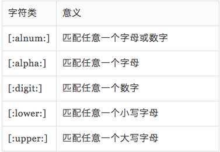
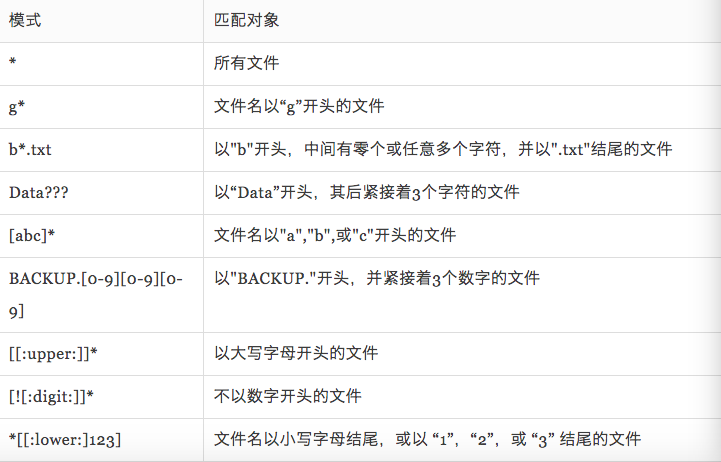
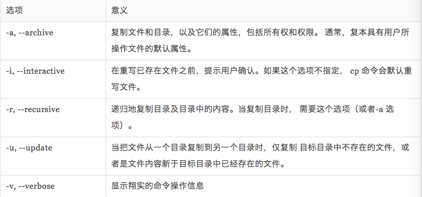
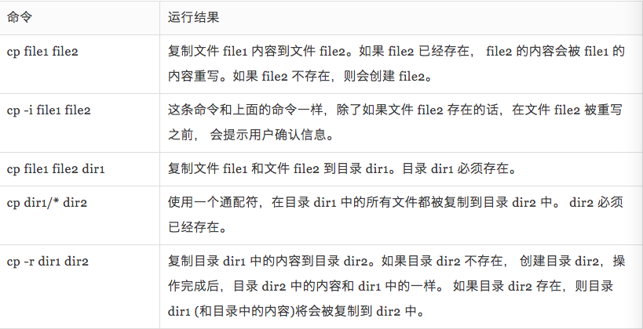
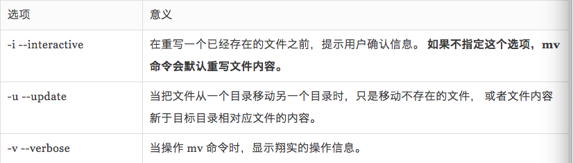
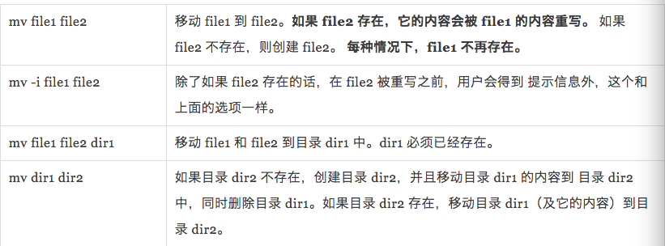
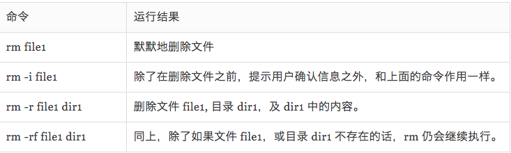

# 文件和目录等操作

## [目录](./summary.md)

- ## 基本操作

    - cp--复制

    - mv--移动或者是重命名

    - mkdir--创建一个目录文件(通俗讲也就是说创建一个目录只不过Linux处处皆文件故称之)

    - rm--删除文件

    - ln--创建硬连接

- ## 通配符

    > 通配符其实也就代称相当于css中的选择器

    - 通配符的匹配关键符号：<br><br>

    - 通配符的关键符号的一些具体用法：<br><br>

    - 一些经典案例：<br><br>
- ## mkdir

    - 基本用法：`mkdir file1 file2 file3...`可以同时创建多个文件

- ## cp

    - 基本用法：<br><br>

    - 用法案例：<br><br>

- ## mv

    - 移动或者是重命名文件

    - opinions:<br><br>

    - 用法案例：<br><br>

- ## `rm`

    - rm含义是：删除文件或者目录

    - opinions<br><br>

    - example:<br><br>

    - `rm -f`意思是删除文件夹和文件夹中的文件，但是如果里面都是空的话，这个命令就无法使用。

- ## `rmdir`
    - 删除文件夹
    - opinions:
        - `-p`也就是删除输入路径的所有内容
        ```bash
        rmdir -p /s/ss
        ```

        - 这样的结果就是ss和s都没有了也就是当子目录被删除后如果父目录也变成**空目录**的话，就连带父目录一起删除。

    - 删除文件和文件内所有内容不妨可以这么做`rmdir ./example/* `然后在`rmdir ./example`这样就没问题了不存在文件夹是空的啊或者是文件夹不是空的啊文件夹不是文件啊这种错误了

- ## rm rmdir 总结：

    - rm删除文件和文件夹，但是使用的时候通常会显示出，这个文件是文件夹无法删除的字样。通常一个文件夹里只有一个文件的话使用`rm -r`可以删除文件和这个文件夹，如果不是只有一个文件的话，那么这个文件夹是不能被删除的。

    - rmdir删除的是文件夹，不能删除文件，如果想删除文件夹和文件夹中的所有文件可以使用`rmdir ./name/*`先删除所有的内容然后使用`rmdir ./name`就可以删除这个空的文件夹了。

- ## ln
    - 硬连接和软连接(也叫符号连接)的命令

    - `ln file link`硬连接file是文件后面是原路径

    - `ln -s item link`软连接

    - 硬连接有两个局限性：
        - 一个硬链接不能关联它所在文件系统之外的文件。这是说一个链接不能关联与**链接本身不在同一个磁盘分区上的文件**。

        - 一个硬链接不能关联一个**目录。**
    - 软连接：跟这个文件系统的元文件并没有关系了，它是另外一个体系的文件，跟硬连接这种存在于元文件中的东西不同，它类似win中快捷方式，不过win是抄袭的unix罢了😄。
    - 硬连接，就是对于元文件中的索引节点的复制，也就是相当于有很多的索引节点。并且这些节点的意义存在是相同的都是代表了这个文件，因为文件本身的名字并没有什么卵用，也就是说索引节点才是真实的名字，相当于你给一个人起了很多名字一样，但是这都是它的名字，而软连接不一样它不属于这个文件，或者说这个内存区域的一份子，它不属于这个元文件，它是另一个不相干的东西，它有自己的元文件，可以说它是一个特殊的文件罢了，它指向了文件，这就是软连接，举个例子就相当于你的职位一样，说老师就代表了你但是你跟老师这个名称在户口本上半毛线关系都没有啊所以说软连接要比硬连接更加灵活。

## 对于硬连接和软连接总结一句话

- 硬连接是一个文件链接到一个文件上
其实就跟把这个文件复制一份差不多，只不过文件等储存位置和容量并没有增多。
- 软连接是一个目录链接到一个文件或者是文件夹上。
- 被链接者都是在中间位置，新的链接文件或者是文件夹在后面
- `ln -s ./appp app`

- `ln ./app.jpg fdfdf.jpg`

- 第二个很明显前后都是文件.jpg第一很明显是文件夹。

- 测试gif:<br><br><br><br>


## [目录](./summary.md)
