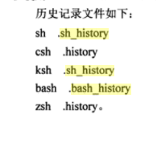

# linux键盘的高级操作
## [目录](.https://github.com/shgopher/GOFamily/tree/master/%E5%85%A5%E9%97%A8%E7%AF%87/%E6%93%8D%E4%BD%9C%E7%B3%BB%E7%BB%9F/shell)
## 先看看基本的命令
- clear 清理屏幕
- history 找寻之前的命令大概是有500条
## 移动光标的命令
- Ctrl-a	移动光标到行首。
- Ctrl-e	移动光标到行尾。
- Ctrl-f	光标前移一个字符；和右箭头作用一样。
- Ctrl-b	光标后移一个字符；和左箭头作用一样。
- Alt-f	光标前移一个字。
- Alt-b	光标后移一个字。
- Ctrl-l	清空屏幕，移动光标到左上角。- clear 命令完成同样的工作。
## 修改文本
- Ctrl-d	删除光标位置的字符。
- Ctrl-t	光标位置的字符和光标前面的字符互换位置。
- Alt-t	光标位置的字和其前面的字互换位置。
- Alt-l	把从光标位置到字尾的字符转换成小写字母。
- Alt-u	把从光标位置到字尾的字符转换成大写字母。
## 粘贴和复制
- Ctrl-k	剪切从光标位置到行尾的文本。
- Ctrl-u	剪切从光标位置到行首的文本。
- Alt-d	剪切从光标位置到词尾的文本。
- Alt-Backspace	剪切从光标位置到词头的文本。如果光标在一个单词的开头，剪切前一个单词。
- Ctrl-y	把剪切环中的文本粘贴到光标位置。
> meta key 在现代的计算机上一般是 alt
## tab
- 含义：就是自动帮你补全你想要的路径文件名等。
## set 
 set命令作用主要是显示系统中已经**存在**的shell变量，以及设置shell变量的新变量值。使用set更改shell特性时，符号"+"和"-"的作用分别是打开和关闭指定的模式。
 
 set命令不能够定义新的shell变量。如果要定义新的变量，可以使用`declare`命令以变量名=值（valueNmae='something'）的格式进行定义即可。
 ## 历史命令展开
 - 用法：`!lineNumber`举个例子：`!88`

 ```bash
 !300
man -a
What manual page do you want?

 ```
 很好的调出来在history记录的第300条记录
 > history 储存~/bash_history
 > 至于sh_history等请忘下看：

>sh(全称Bourne Shell)，是UNIX最初使用> 的shell，而且在每种UNIX上都可以使用。

>Bourne Shell在shell编程方便相当优秀，但在处理与用户的交互方便作得不如其他几种shell。
bash（全称Bourne Again Shell），LinuxOS默认的，它是Bourne Shell的扩展。

>与Bourne Shell完全兼容，并且在Bourne Shell的基础上增加了很多特性。可以提供命令补全，命令编辑和命令历史等功能。它还包含了很多C Shell和Korn Shell中的优点，有灵活和强大的编辑接口，同时又很友好的用户界面。
>csh(全称C Shell)，是一种比Bourne Shell更适合的变种Shell，它的语法与C语言很相似。

>Tcsh是Linux提供的C Shell的一个扩展版本。

>Tcsh包括命令行编辑，可编程单词补全，拼写校正，历史命令替换，作业控制和类似C语言的语法，他不仅和Bash Shell提示符兼容，而且还提供比Bash Shell更多的提示符参数。
ksh(全称Korn Shell)，集合了C Shell和Bourne Shell的优点并且和Bourne Shell完全兼容。

>pdksh，是Linux系统提供的ksh的扩展。

>pdksh支持人物控制，可以在命令行上挂起，后台执行，唤醒或终止程序。

所以他们的历史文件都在~中存在，那么对应的文件应该是：


## 关于history的快捷键

- `control + r`在历史中搜索多次按可以换不同的命令（拥有同样的关键词）
- `control + j` 将这条命令复制到正在执行的地方

这里还有一些其它的命令：


- Ctrl-p	移动到上一个历史条目。类似于上箭头按键。
- Ctrl-n	移动到下一个历史条目。类似于下箭头按键。
- Alt-<	移动到历史列表开头。
- Alt->	移动到历史列表结尾，即当前命令行。
- Ctrl-r	反向递增搜索。从当前命令行开始，向上递增搜索。
- Alt-p	反向搜索，不是递增顺序。输入要查找的字符串，然后按下 Enter，执行搜索。
- Alt-n	向前搜索，非递增顺序。
- Ctrl-o	执行历史列表中的当前项，并移到下一个。如果你想要执行历史列表中一系列的命令，这很方便。
## 历史命令展开

- !!	重复最后一次执行的命令。可能按下上箭头按键和 enter 键更容易些。
- !number	重复历史列表中第 number 行的命令。
- !string	重复最近历史列表中，以这个字符串开头的命令。
- !?string	重复最近历史列表中，包含这个字符串的命令。

实测：

```bash
!?date
echo "$(date)"
Mon Sep 11 20:10:48 CST 2017
```
是有用的。😀。

## [推荐好文任意门>>>>](https://zh.wikipedia.org/wiki/%E7%B5%82%E7%AB%AF)


