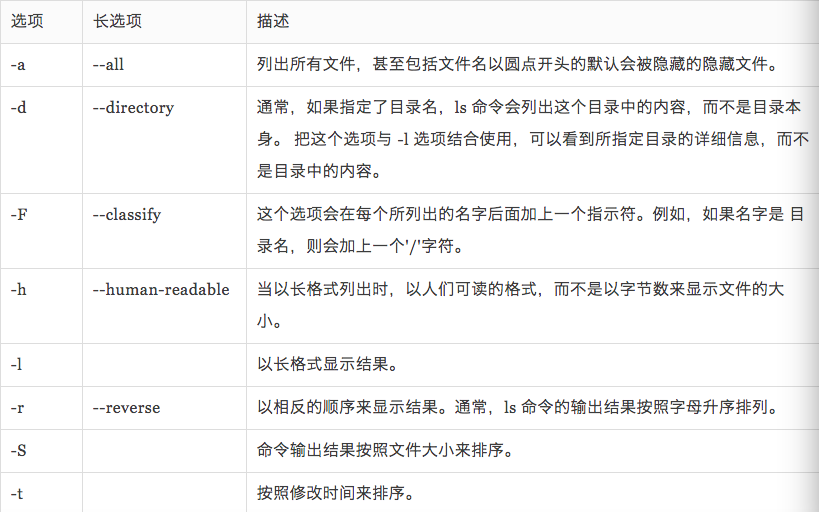
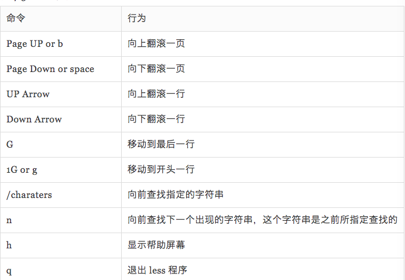

# 探究Linux本身的很多特性

## [目录](./summary.md)

- 重点详细介绍ls,file,less这三个命令。

## ls

- `ls - a`刚才已经介绍过了是为了打开隐藏的文件。

- 你可以打开任意的目录`ls /bin`这样也是可以的。

>   
    /Users/thomashuke/Desktop:
    code

    /bin:
    [		df		launchctl	pwd		test
    bash		domainname	link		rm		unlink
    cat		echo		ln		rmdir		wait4path
    chmod		ed		ls		sh		zsh
    cp		expr		mkdir		sleep
    csh		hostname	mv		stty
    date		kill		pax		sync
    dd		ksh		ps		tcsh
    thomasdeMacBook-Air:~ thomashuke$
- `ls -l`长模式输出

    > 也就是说会显示一大堆的文件---显示全部的信息。

- `ls -lt`意思就是短选项l和短选项t同时作用这里就要说明了

    > linux中有短选项和长选项例如-就是短选项--version就是长选项，长选项的缩写就是短选项例如`--verision => -v`并且linux中短选项可以同时写`-lt`就是`-l -t`的缩写。

- ls常用命令集锦：

    

    > 由图可以看出来长选项几乎都有可以对应的短选项，使用的时候要注意如果有短选项就使用短的就好，没有在使用长选项 （英语：opinions）

    - `ls -i`现实文件索引节点的信息。

---
## file功能
- file命令返回文件类型

- `file fileName`

- 一个简单的显示举例
    ```bash
    file README.md

    // UTF-8 Unicode text
    ```
---

## less命令

- less的含义是浏览文本

- 退出不使用esc不使用control+c

- 退出使用`q`即可
    ```bash
    q

    //为了明显我刻意单列出来
    ```
- less命令：

    

- 关于Linux或者说类unix中一些常用的路径到总结，大部分是如此，但是不排除有特殊情况：<br><br>

---

## 软硬链接

- 一句话：软连接就像是***指针***一样

- 软连接和硬连接简单来说就是：
    - 软：再配几把新钥匙(钥匙可以是不一样的)，其实是拥有不同的inode
    - 硬：根据原钥匙copy几把钥匙(钥匙可以是不一样的)，拥有相同的inode
    ---
   > 硬链接(hard link)：文件A是文件B的硬链接，则A的目录项中的**inode**节点号与B的目录项中的inode**节点号相同**，即一个inode节点对应两个不同的文件名，两个文件名指向同一个文件，A和B对文件系统来说是**完全平等**的。如果删除了其中一个，对另外一个**没有影响**。每增加一个文件名，inode节点上的**链接数增加一**，每删除一个对应的文件名，inode节点上的链接数**减一**，直到为0，inode节点和对应的数据块被**回收**。注：文件和文件名是不同的东西，`rm A`删除的只是A这个文件名，而A对应的数据块（文件）只有在inode节点链接数减少为0的时候(也就是说这些文件名一个都不剩余了)才会被系统回收。

    > 软链接(soft link)：A是B的软链接（A和B都是文件名），A的目录项中的inode节点号与B的目录项中的inode节点号不相同，A和B指向的是两个不同的inode，继而指向两块不同的数据块。但是A的数据块中存放的只是B的路径名（可以根据这个找到B的目录项）。A和B之间是“主从”关系，如果B被删除了，A仍然存在（因为两个是不同的文件），但指向的是一个无效的链接。

## [目录](./summary.md)
