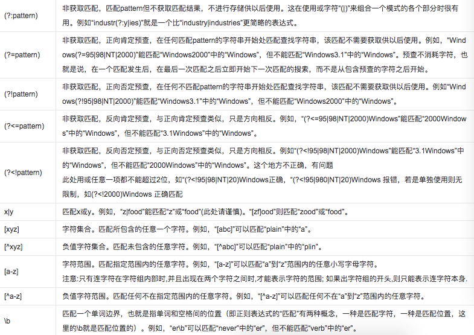

# 重头戏 --- 正则表达式
## [目录](.https://github.com/shgopher/GOFamily/tree/master/%E5%85%A5%E9%97%A8%E7%AF%87/%E6%93%8D%E4%BD%9C%E7%B3%BB%E7%BB%9F/shell)
## 正则表达式表述：

正则表达式，又称规则表达式。（英语：Regular Expression，在代码中常简写为regex、regexp或RE），计算机科学的一个概念。正则表通常被用来检索、替换那些符合某个模式(规则)的文本。

**正则表达式的重要性：** 基本的正则语法是一样的，核心相同。正则表达式是独立于各种语言之外的，你在几乎任何的语言都能看到正则的身影，关键是它非常的方便啊！！！能快捷的解决很多问题啊，很爽啊，有木有！！！
> 不过话又说回来了，很多高级特性在不同语言中还是不同的。。。。。。
## 说起正则要提提 grep

grep的正确使用方式

`grep opinions regex file_name`

### grep 选项

|选项|	描述|
|-|-|
|-i|	忽略大小写。不会区分大小写字符。也可用--ignore-case 来指定。
|-v|	不匹配。通常，grep 程序会打印包含匹配项的文本行。这个选项导致 grep 程序 只会不包含匹配项的文本行。也可用--invert-match 来指定。
|-c|	打印匹配的数量（或者是不匹配的数目，若指定了-v 选项），而不是文本行本身。 也可用--count 选项来指定。
|-l|	打印包含匹配项的文件名，而不是文本行本身，也可用--files-with-matches 选项来指定。
|-L|	相似于-l 选项，但是只是打印不包含匹配项的文件名。也可用--files-without-match 来指定。
|-n|	在每个匹配行之前打印出其位于文件中的相应行号。也可用--line-number 选项来指定。
|-h|	应用于多文件搜索，不输出文件名。也可用--no-filename 选项来指定。

### 举例说明

```bash
grep -i a*.jpg newOne.text

bash
cat
date
domainname
hostname
launchctl
pax
wait4path
```
很明显这里忽略大小写，并且寻找开头是a然后结尾是.jpg的文件 并且在 newOne.text中寻找，但是很好的是，grep接受输入流，它可以| 并不像ls一样不接受输入流只接受“返回值”---参数。

## 元字符和文本

由以下字符组成各种正则`^ $ . [ ] { } - ? * + ( ) | \`
> 我们要把很多在shell中的字符转移是为什么呢？

原因其实很简单，这些字符例如说\\,它在shell中，有者特殊的含义，也就是说它是跟`if`这种是一个类型的，但是呢在re中它又有它本身的含义，这时候我们为了不让shell引擎解释它我们就需要使用''来让它定义为文本，或者使用`\`转移。

^ 头部

$ 尾部

例如 ^zip zip$ 头部 zip 和尾部 zip
## 小知识
[linux中自带的词典](../../picture/libary.md)

方法是：
```bash
touch libary.md

cat /usr/share/dict/words >> libary.md

```
## `.`
`.`的用法就是代指任意一个的字符。\*是代指一切东西，但是不能代替的是换行符`\n`

当该字符紧跟在任何一个其他限制符
\*,+,?，{n}，{n,}，{n,m}）后面时，匹配模式是非贪婪的。非贪婪模式尽可能少的匹配所搜索的字符串，而默认的贪婪模式则尽可能多的匹配所搜索的字符串。

## 中括号表达式和字符类[abc]
for example :
```bash
find -type d -name [apd]le \bin

```
意思就是寻找的是一个指定为目录，并且名字叫做ale或者是ple或者是dle的一个目录。

## 否定的括号[^abc]
for example
```bash
find -type f -and -name [^apple]le /bin
```
意思是在/bin目录下，我们要求这个find的寻找是 类型是文件 并且 名字是 开头不是apple的后面接上去是le的文件名。

## `*`
这个也是代指任意，但是它不分贪婪不贪婪，就是它是很随意的，比如谁ao*,它的意思就是说它可以匹配aoooo也可以匹配ao
## [a-b]结构
这种结构的目的是缩写
for example：
```bash
^[a-bA-B0-9]
```
意思是开头是字母或者是数字的情况
### 连字符问题

在字符区域中，我们看到这个连字符被特殊对待，所以我们怎样在一个正则表达式中包含一个连字符呢？ 方法就是使连字符成为表达式中的第一个字符。

# ⚠️ 警告
##  通配符和正则表达式是不一样的。

 通配符与正则表达式很容易混淆，首先要明白二者是不同的，个人感觉通配符用于Linux的shell命令（如**文件名**相关操作）中，而正则表达式用于**文本内容**中的字符串搜索和替换等。**通配符是Linux系统本身就支持的**，而正则表达式用于vim编辑器或awk程序，**这些文本处理工具正是由于支持正则表达式才变得强大。**在文本过滤工具里，都是用正则表达式，比如像awk，sed，等，是针对文件的内容的

而通配符多用在文件名上，比如查找find，ls，cp，等等**

 通配符中的一些字符

 POSIX 字符集

|字符集|	说明|
|-|-|
|[:alnum:]	|字母数字字符。在 ASCII 中，等价于：[A-Za-z0-9]
|[:word:]	|与[:alnum:]相同, 但增加了下划线字符。
|[:alpha:]	|字母字符。在 ASCII 中，等价于：[A-Za-z]|
|[:blank:]	|包含空格和 tab 字符。
|[:cntrl:]	|ASCII 的控制码。包含了0到31，和127的 ASCII 字符。
|[:digit:]	|数字0到9
|[:graph:]	|可视字符。在 ASCII 中，它包含33到126的字符。
|[:lower:]	|小写字母。
|[:punct:]	|标点符号字符。在 ASCII 中，等价于：
|[:print:]	|可打印的字符
|[:graph:]|所有字符，再加上空格字符。
|[:space:]	|空白字符，包括空格，tab，回车，换行，vertical tab, 和 form feed.在 ASCII 中， 等价于：[ \t\r\n\v\f]|
|[:upper:]	|大写字母。
|[:xdigit:]|	用来表示十六进制数字的字符。在 ASCII 中，等价于：[0-9A-Fa-f]
## 通过lang可以直接按照什么语言的顺序排列
`locale`
就可以列出命令
```bash
LANG=
LC_COLLATE="C"
LC_CTYPE="UTF-8"
LC_MESSAGES="C"
LC_MONETARY="C"
LC_NUMERIC="C"
LC_TIME="C"
LC_ALL=
```

```bash
 export LANG=POSIX
 ```
上面的命令是通过export导出来shell命令然后让它变成bash环境变量

把这条语句添加到你的.bashrc 文件中，你可以使这个更改永久有效。

## 注明所有的元符号的理论




## 非贪婪模式
贪婪模式使用？即可。例如
```bash
ls / | grep -i \(?[a-z][A-Z]\)?
```
这个地方就是匹配了贪婪模式，也就是说前后两个括号要重复一次或者是多次，偏向于1次，这就是贪婪模式。
## 贪婪模式
使用* 意思是尽可能的多匹配前面的那个字符

当然字符必须存在，不像是通配符，通配符的话，*代表了前面无穷无尽个数字*

## 详细的匹配的次数使用{}

  例如说是aa匹配10次

  那么就是
  ```bash
  ^(aa){10}(ddra)$
  ```
  很明显这个词语的意思是开头以aa为组的这个数据10次，以ddra为组的数据结尾即可，符合这个条件的数据均可以被匹配到。
## 类
```bash

[[:class:]]

# 举个例子：

[[:upper:]]

```
这个例子是大写字母类

对比
```bash
[A-Z]
```
也有这个意思，但使用类要更加有兼容性。
## +
功能类似于*
## {}

精确的解释是有四种方式
- `{n}` 匹配n次
- `{n,m}`最少匹配n次最多匹配m次
- `{,m}` 最多匹配m次
- `{n,}`最少匹配n次

## 在find中使用的正则

注意：find 正则表达式是匹配全路径（包含文件名和相对路径），它不是搜索。也就是说所写的正则必须能够匹配整个搜索目录路径和文件名的组合，而不是单单匹配文件名本身。

但是通配符不一样，它不需要使用-E来调出来，直接就可以使用。并且代指的是文件名

## 讨论（关于命令不关于文本）
在find或者是 locate或者是很多的很多的命令时，我们都应该先考虑通配符，因为通配符相对简单，当然肯定没有正则那么强大，当我们在文件中查找一个什么命令的时候，我们用正则比较好，

**关于命令式使用哪个一句话总结：**

简单时刻用通配符

复杂时刻用正则（-regex即可）
