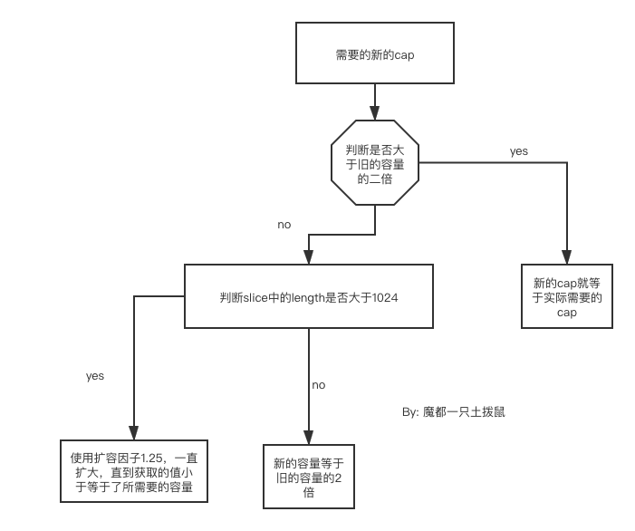

# 数组
> 字符串是由数组构成的。
## 数组是如何快速寻址的

首先要清楚数组的结构是什么，数组是具有连续内存地址的储存结构，所以说这个连续就很关键了，所以为什么
数组的寻址可以达到时间复杂度是O(1),因为它寻址的过程是 `arr[i] = &arr[o]+i*size`
> 注：size是指的每一个的数组的size，占用了几个位，例如普通的int就是4个字节。

所以说数组的查找时间复杂度是1，但是因为插入或者删除，要往后移动，那么最好就是最后一位，最差就是插入第一位，
那么平均时间复杂度就是 (n + n-1+n-2 + ...1)/n = 2/n (加权算法，因为每次的概率都是1/n)所以算出来最后的结局就是n

go中的数组`arr1 := [1]int{1}`,与此同时还应该对应着一个非常像的数据结构切片`sli1 := arr1[:]`
切片的数据结构如下

```go
type Slice struct {
  Cap int
  Length int
  Array unsafe.Pointer
}
```
所以说我们可以认为，go中任何的数据结构都是实际的复制，就连引用类型也是，只不过，引用类型内部是一个非
引用类型的地址。

## go中关于切片的操作

 ```go

 sli1 := make([]int, 2,5)
 sli1 = append(sli1,3)
 // sli1 = []int{0,0,3}
arr1 ：= [2]int{1,1}
sli2 := arr1[0:2]// output []int{1,1} 取前不取后

 ```
这里对append做一个总结，也就是说append获取的最后的值是按照length来获取的，并不是cap，在go中任何的越界等
行为都是按照length来决定的，不是cap。

 举个例子

 ```go
    sli1 := make([]int,2,5)
    sli1  = append(sli1,3)
    sli1[4] = 1
    fmt.Println(sli1)
 ```

 output:  panic: runtime error: index out of range [4] with *length* 3
main.main()

所以说不管是append或者是copy，都是针对的length，cap只是底层数组的长度，仅此而已，然后切片是动态扩容的。

下面说一下copy

```go
  sli1 := make([]int,2,5)
  sli1  = append(sli1,3)
  sli2 := make([]int,2,5)
  sli2[0] =1
  copy(sli2,sli1) // 这一步就证明了，copy操作也是对于len，并且它会将前者清空。
  fmt.Println(sli1)
  fmt.Println(sli2)
```
output：

`[0 0 3]
[0 0]
`
##  切片扩容源代码分析

```go
// 本代码源自go源码
// 这里的cap是需要的cap的大小，
newcap := old.cap
	doublecap := newcap + newcap
	if cap > doublecap { // 当要扩容的容量比老的容量大于老2倍的时候，直接采用所需要的容量当容量
		newcap = cap
	} else { // 当不满足所需容量大于老容量两倍的时候
		if old.len < 1024 { // 判断老的len的长度，当小于1024，那么新的容量就是老容量的二倍。
			newcap = doublecap
		} else {
			// Check 0 < newcap to detect overflow
			// and prevent an infinite loop.
			for 0 < newcap && newcap < cap { // 如果是大于1024个的时候，每次都是增益1.25倍率，然后直到再次增益大于了所需的容量了，就OK了。
				newcap += newcap / 4
			}
			// Set newcap to the requested cap when
			// the newcap calculation overflowed.
			if newcap <= 0 {
				newcap = cap
			}
		}
	}

```
为什么不建议使用append而是使用copy作为slice的复制，因为使用append是否开辟新的内存地址不一定，但是copy就不会，
它就是复制而已。
## 总结
- go中的数组系列中，切片才是最常用的
- 切片的操作一切的包括越界，复制，等等是看的length不是cap
