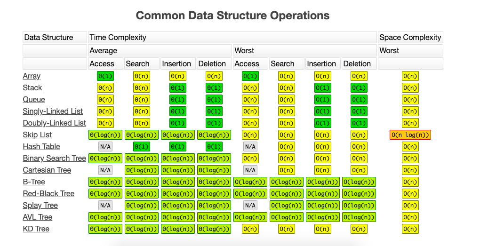
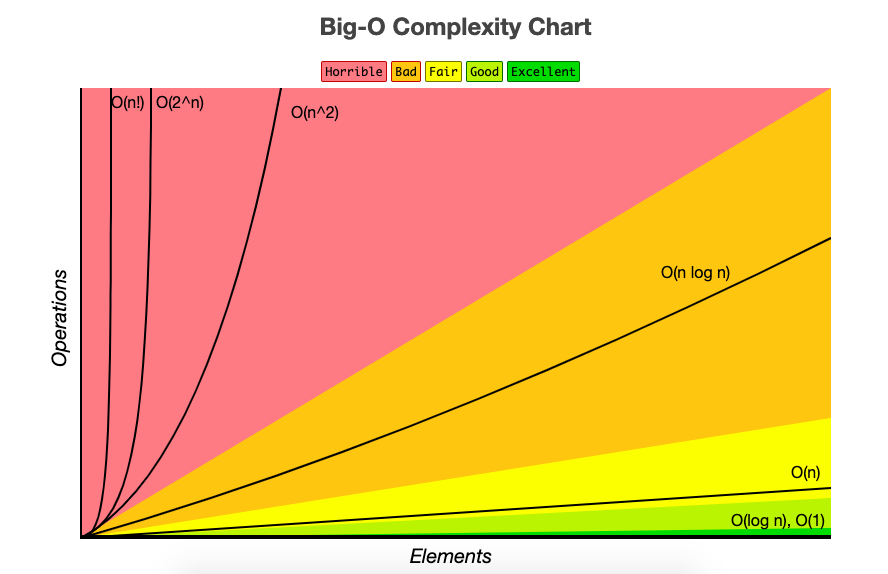

# 时间复杂度
## 常见的时间复杂度
- 二分查找 O(logn)
- 归并排序，快排 O(nlogn)
- 二叉树的遍历 O(n)
- 排序的查找 二维是O(n)，一维就是O(logn)

注意 如果是n和m不知道谁的量级大，就直接使用m+n 或者是m x n
### 排序算法的时间复杂度

### 常见数据结构的时间复杂度

## 进阶
- 最好时间复杂度
- 最坏时间复杂度
- 平均时间复杂度
- 均摊时间复杂度

一般来说 最好和最坏比较常见。
## 时间复杂度的对比示意图

