# 函数和方法
重点内容前情提要

- 函数初始化的顺序
- init 函数
- defer的运用
- 变长参数
- 类型嵌入来完成继承
- define类型的方法集合
- 类型别名的方法集合
- 函数式编程

go 语言中函数的基本使用方法如下：

```go
// 函数的一般用法, go 拥有多个返回值
func Get(i int)(int, error) {
  return 0, nil
}
// 返回值具有变量的返回模式
func Post(i int)(value int){
  value = 1
  return
}

// 函数作为value值赋值给一个变量变量
var Get0 = func(i int) int {
  return 0
}
```

## 函数的初始化顺序


- main 函数是所有go可执行函数的起始位置
- 在main函数运行前，需要先运行导入子包的流程
- 在导包的过程中，最先运行的是最深层的子包
- 按照 **常量，全局变量，init函数** 的顺序进行初始化的操作
- 子包初始化之后，开始返回前一层的包中进行常量，全局变量，init函数的初始化，图示流程非常清晰的画出了这个过程。
- 多个相同的包只会导入一次，并且取相同包不同版本的可满足的最小版本导入，例如 `v1.1.0 v1.2.0`，只导入`v1.2.0`，不会默认导入最新的版本。

## init 函数
在一个包中，以及在一个包的某个文件中，可以存在多个init函数，一般来说，同一个包的不同file，按照文件字符串比较的“从小到大”的顺序先被编译file中的init先执行，同一个file中的init函数按照先后顺序执行，但是go语言规范告诉我们，不要依赖init的执行顺序。

init 函数无法主动执行，它的执行是系统自动执行的，所以显式的去调用 init 函数会发生报错。

通常来说，init的目的就是系统的初始化，因为它一定会被执行，下面我们介绍一下init函数的几个用途。

***重置包级变量值。***

```go
// src/context/context.go

var closedchan = make(chan struct{})
func init(){
  close(closedchan)
}
```
我们的包级变量是一个chan，并且需要它是一个已经关闭的chan，我们使用init来确保它提前一定处于一个已关闭的状态。

***对包级变量进行初始化，保证其后续可用。***

```go
var (
  OutBox []int
  InBox  chan int
)

func init(){
  OutBox = make([]int, 10)
  InBox = make(chan int, 10)
}
```

***init 函数中的注册模式。***

这种模式在go中有两处经典的案例，其一是 `database/sql` 包的使用，其二是image包的使用。

```go
// databsae/sql 包的使用

import(
  "database/sql"
  _ "github.com/lib/pq" 
)

func main() {

  db, err := sql.Open("postgres", "")
}
```
这里使用`import _` 就是只有导包的过程，并没有任何除了init 函数之外的函数调用。那么这么做的原因是什么呢？

`工厂方法 + 导包的顺序`

下面我们看一下这两个包的源码

```go
// github.com/golnag/go/src/database/sql/sql.go
var drivers = make(map[string]driver.Driver)

func Open(driverName, dataSourceName string) (*DB, error) {
	driveri, ok := drivers[driverName]
}

func Register(name string, driver driver.Driver) {
	drivers[name] = driver
}
```
- sql 包有一个全局的map，这里存放了所有的driver，这个map的key是driver的名字，value 是 driver.Driver 的接口类型，通常来说存入的都是实现了这个接口的动态类型。
- open 函数会直接判断是否拥有含有这个key的value值
- register 函数，也就是注册函数，这个函数通常由实现了sql.driver的数据库第三方库的init函数去进行最终的注册。

```go
// github.com/lib/pq

func init() {
	sql.Register("postgres", &Driver{})
}
```
- 这里就是实现了sql.Driver 的 pq.Driver 结构体进行了名为“postgress”的注册。

下面我们进行整体的分析：

-  在pq包实现的时候，它引入了"database/sql" ，"database/sql/driver" 这两个包，它将实现的数据库实例注册到sql的map中
- 用户调用的时候，我们调用了 `sql.Open` 使用不同的name就可以使用不同的数据库，这里是工厂方法设计模式的运用

这种方法可以使pq这个包完全没有暴露到用户面前，仅需要使用sql包就可以间接的使用pq的代码，很好的做了隔绝。

下面看一下 image包的运用。

```go
package main

import(
  "image"
  _ "image/png"
  _ "image/gif"
  _ "image/jpeg"
  "os"
)

func main(){

  width,height,error := image(os.Args[1])
  if error != nil{
    println(error)
  }
  println(width, height)

}

func image(f string)(int,int,error){
  file,err := os.Open(f)
  defer file.Close()

  img, _, err := image.Decode(file)
  if err != nil {
    return 0,0,err
  }

  b := img.Bounds()
  return b.Max.X,b.Max.Y,nil
}
```

我们发现，image.Decode(f) 应该就如同上文提到的 Open 函数一样的功能，也就是工厂方法中的工厂。

下面我们看一下 image/gif 包中的init函数：

```go
//https://github.com/golang/go/blob/master/src/image/gif/reader.go

func init() {
	image.RegisterFormat("gif", "GIF8?a", Decode, DecodeConfig)
}
```

可以看到，这个gif包也是调用了image包，并且通过 init函数，将动态类型注册到了image提供的注册器中。

***init 函数中检查失败的处理方法。***

使用init去检查某些数据的正确性，相当于做最后的质检工作，一旦发生了错误，直接使用Panic，快速停掉程序。

## defer 函数
```go
func Get(){
  f,err := os.Open("test.txt")
  if err != nil{
    panic(err)
  }
  // 此处就是 defer 函数
  defer f.Close()  
}
```
defer函数有下面几个规则
- defer后面只能跟函数或者是方法
- 一个函数中的defer函数，会使用“栈”的方式运行
- defer后面的函数和方法，返回值会被直接舍弃

下面看一下defer函数的几种用法

***配合recover函数处理 panic***

在go里，如果要处理函数内的panic，有且仅有一种方法，那就是使用recover函数。而且recover函数必须运行在defer之中。那么让我们看一下具体的代码实现

```go
func Get() {
	defer func() {
		if err := recover(); err != nil {
				println("recoverd")
		}
	}()
	panic("panic")
}
```
***修改函数的具名返回值***

具名返回值，就是返回值带有变量的，比如：
```go
func hi(a,b int)(x,y int){
  defer func(){
    x ++
    y ++
  }()
  x = a+b
  y = a-b
  return  
}
// hi(1,3) 返回值为 (5,-1)
```
在分析这段代码的时候，我们要牢记一句话，在具名返回值的函数中，go的return并不会立刻return，它会等待defer执行完毕后再真的return。也就是说，它return的是 x y 的最后时刻。

那么，让我们看一下非具名的函数：

```go
func hi(a,b int)(int,int){ 
	var x,y int
  defer func(){
    x ++
    y ++
		println("defer 会执行的")
  }()
  x = a+b
  y = a-b
  return  x, y
}
// hi(1,3) 

// output:
// defer 会执行的 5 -1
// 4 -2
```
在非具名的函数中，return x，y 的时候就已经决定返回值的最终结果了，但是这个defer还是会执行，这个是真的，xy的值确实也是在defer里改变了，但是return的是之前的中间量，defer里面的xy，并不会左右之前已经设定好的x y 的复制值了。

所以输出的是 4 -2 ，而且defer里面的输出 “defer 会执行的 5 -1” 也执行了。

defer函数虽然是先入后出，在所有的正式指令执行完成以后执行，但是它的变量初始化可是顺序的：
```go
func hi(a, b int) (x, y int) {
	j := 0
	defer func(j int) {
		println(j)
	}(j)
	j++
	return
}
// output: 0
```
这里的 defer 顺序执行完变量的初始化，所以它里面的j变量完成了值的复制，为 0，那么下文的 j++ 就不会对上面的复制品起任何作用了，即便 prinln(j) 确实发生在 j++ 之后，总结一句话，defer 函数执行是最后，但是初始化是正常的先后顺序。

如果想得到 1 的答案，可以这么改：
```go
func hi(a, b int) (x, y int) {
	j := 0
	defer func() {
		println(j)
	}()
	j++
	return
}
```
这里的j**就会**受到下面j++的影响了。

还有一点要注意，defer函数的作用域也是正常的作用域，也就是说，上文hi函数演示内容，j:= 0 必须声明在defer 函数之前，虽然我们知道defer的内容最后执行，但是它也遵循正常的作用域。如果j := 0 发生在defer之后，它就会无法找到这个变量。

看了上面那么多容易搞混的defer用法，这里要说明一下，正常的使用方法是这样的：

```go
func hi(a,b int)(x,y int){
  defer func(){
    x ++
    y ++
  }()
  x = a+b
  y = a-b
  return  
}
```
也就是我们第一种使用的惯例，它的效果就是最后改变返回值，这也是这几种方式中最常用的方式。

看了上文关于 defer 函数的初始化 int 类型参数以后，我们还得注意切片在 defer 函数初始化参数的问题，因为它更容易出现误判。

```go
func Get(){
  s1 := []int{1,2,3}
  defer func(v []int){
    println(v)
  }(s1)
  s1 = []int{4,5,6}
}
```
```go
func Get(){
  s1 := []int{1,2,3}
  defer func(v *[]int){
    println(v)
  }(&s1)
  s1 = []int{4,5,6}
}
```
- 前者输出 1 2 3
- 后者输出 4 5 6

我们分析一下：
> **❗️这个地方很容易搞错，望周知。**

首先我们确定的一件事就是：**defer函数的参数初始化是顺序执行的**，它顺序执行之后，将数据保存在了一个专用的栈中。

所以，第一个函数中，v 就等于 []int{1,2,3}，换言之，v初始化的时候等于一个指向底层数据是 1 2 3 的数组，所以当s1 重新指向一个新的数据 4 5 6 的时候，v的数据并不会有任何的影响，它仍然执行的还是底层数据是 1 2 3 的数组，所以它的最终结果就是输出 1 2 3

第二个函数，在初始化阶段，v正常的初始化，它的值是 s1的地址，那么当下文中s1重新指向了一个新的底层数组为 4 5 6 的数据之后，v的数据是一直跟着s1走的，因为它的本质是s1的地址，这把钥匙一直都没有变化，所以它的最终结果就是新的内容 4 5 6 

最后提一嘴，defer函数的性能消耗（go 1.14+），跟不使用defer相比，几乎没有差距，所以放心大胆的使用defer。


***输出调试信息***

```go
func trace(s string)string{
  println("prepare",s)
  return s
}
func un(s string){
  println("out",s)
}
func a(){
  defer un(trace("a"))
  println("in a")
}
func b(){
  defer un(trace("b"))
  println("in b")
  a()
}
func main(){
  b()
}

// prepare b
// in b
// prepare a
// in a
// out a
// out b 
```

这是go文档提供的一个日志记录的例子，接下来我们分析一下

- 首先b的执行，b中的defer函数 un开始初始化，它的初始化就是执行trace("b"),所以最先执行的是 prepare b
- 然后开始执行 println("in b")
- 接下来执行a，跟b一样，先执行初始化的un中的trace("a")函数，然后执行 println（“in a”）
- 然后开始执行a的defer函数，所以a的out先执行，（因为它后入，先出）
- 接下来最后执行的是b中的defer，那么就是 out b

***还原变量的旧值***

```go
func init(){
  oldfile := firstfile
  defer func(){
    firstfile = oldfile
  }()
  firstfile = "README.md"
  //...
}
```

***我们知道，defer后面只能放置函数，包括自匿名函数，或者是自定义的函数以及方法（如果有返回值自动舍弃），那么go内置的函数是否可以放到defer后面执行呢？***

答案是，部分内置函数可以直接放到defer后面，部分不能直接放到defer后面执行，需要放到一个匿名或者自定义函数中。

- 可以直接放到 defer 后面的函数有：close copy delete print recover
- **不能**直接放到 defer 后面的函数有：append cap len make new 

但是通常来说，我们使用defer的时候都是会跟一个匿名函数或者是自定义的函数，并不会直接跟一个内置函数。

比如直接跟匿名函数的：
```go
func Get(){
  defer func(){
    if err := recover(); err != nil {
      println(err)
    }
  }()
  panic("error")
}
```
跟一个自定义函数的：
```go
func Get(){
  f,err := os.Open("README.md")
  
  // defer 后面是一个方法，并且舍弃了这个方法的error参数
  defer f.Close()
}
```

## 变长参数
举个变长参数函数的例子：
```go
func Println(a ...any) (n int, err error) {
	return Fprintln(os.Stdout, a...)
}
```

我们平时使用的 `fmt.Println(...any)` 就是标准的变长参数的例子。

它的组织形式就是 `...` + `类型` ，比如 `...int` `...string`

1. 一个函数的参数中只能有一个变长参数，且必须为最后一位
2. 变长参数在函数内部以slice的方式存在
3. 变长参数只能接受两种形式的值，其一就是多个同样类型的值，例如`fmt.Println("hi","there",12)`，或者直接接受一个`slice... ` ，例如 `fmt.Println([]any{1, 2, "hi"}...)`，并且，这两种用法不能混用，比如 `fmt.Println(1,2,[]any{1,2}...)` 这种混写的方法错误。

any类型和string类型是绝对的不同的两种类型，因为any是interface{}的别名 （`type any = interface{}`），string类型虽然实现了空接口，但是它不是空接口类型，如果要转换成空接口，必须显式的转换:

```go
func main() {
	a := []int{12,3}
	b := any(a)
	fmt.Println(b)
}
```

***go语言在 append 字符串到[]byte 的时候提供了一个语法糖***
  
`func append(slice []Type, elems ...Type) []Type `  

```go
 func main() {
	a := []byte{1, 3, 4}
	var b string = "ee"
	a = append(a, b...)
}
```
这种语法糖只适用于 append 内置函数。底层应该是帮你把字符串转化为了 `[]byte()`

```go
func main() {
    // 类似这种转换
	a := []byte{1, 3, 4}
	var b string = "ee"
	c := []byte(b)
	a = append(a, c...)
}
```

如果自己实现一个的时候不进行转换就会报错。

```go
func get(...byte){

}
func main(){

  get("123"...)
}
// ❌
//cannot use "123" (untyped string constant)
// as []byte value in argument to get

```

### 使用变长函数去模拟重载函数
重载函数就是同一个作用域下，可以有相同名称的函数，只不过他们的参数不同，go语言是不支持这种类型的函数的。

类似这种
```go
func main(){}
func get(){}
func get(s string){}
```
如果真的想使用这种重载函数，我们可以使用这种方法来间接实现：
```go
func Get(s string, args ...any) {
	for _, v := range args {
		switch v.(type) {
		case int8, int, int16:
			fmt.Println(vi)
		case string:
			
		}
	}
}

```
### 使用变长函数去实现默认参数
```go
func main() {
	CheckIn("shgopher", 12, "男")
  CheckIn("jackie",20,"男","上海")
}

type Contents struct {
	Name    string
	Age     int
	Sex     string
	Address string
}

func CheckIn(arges ...any) (*Contents, error) {
	c := &Contents{
		Address: "Beijing ",
	}
	for k, v := range arges {
		switch k {
		case 0:
			name, ok := v.(string)
			if !ok {
				return nil, fmt.Errorf("name is not a string")
			}
			c.Name = name
		case 1:
			age, ok := v.(int)
			if !ok {
				return nil, fmt.Errorf("age is not a int")
			}
			c.Age = age
		case 2:
			sex, ok := v.(string)
			if !ok {
				return nil, fmt.Errorf("sex is not a string")
			}
			c.Sex = sex
		case 3:
			address, ok := v.(string)
			if !ok {
				return nil, fmt.Errorf("address is not a string")
			}
			c.Address = address
		default:
			return nil, fmt.Errorf("unknown argument")
		}
	}
	return c, nil
}
```
这段代码的意思就是先给定一个默认值，比如这里地址是默认值的，也即是它是可选的内容，鉴于这段代码标识的意义，这个可省略的一定是在最后一位的。

# 方法

接下来，我们介绍方法，所谓方法，其实只是函数的一种语法糖，它跟函数并没有本质的区别，我们看一个简单的例子：

```go
type Student struct{
  name string
  year int
  addr string
}

func(s *Student)GetName(name string){
  s.name = name
}
```
可以看到，这是一个定义在指针类型`*student` 上的方法 `GetName`,实际上，它完全等于函数的这种形态：

```go
func GetName(s *Student, name string) {
  s.name = name
}
```
go语言本身对于方法的使用是很宽泛的：
- 指针类型的变量可以使用值类型的方法
- 值类型的变量可以使用指针类型的方法

这跟后文要讲的接口绝对是差距极大，因为接口的要求非常严格，这个可以看接口和函数的对比。

值类型的变量可以使用指针类型的方法
```go
type Student struct{
  name string
  year int
  addr string
}

func(s *Student)GetName(name string){
  s.name = name
}

func main(){
  var s Student
  s.GetName("张三")
}
```
当值类型来使用指针类型的方法时，系统默认会调用这个值的指针，因此这是系统给予的语法糖。

指针类型的变量可以使用值类型的方法
```go
type Student struct{
  name string
  year int
  addr string
}

func(s Student)GetName(name string){
  s.name = name
}

func main(){
  var s = new(Student)
  s.GetName("张三")
}
```
当指针类型来使用值类型的方法时，系统默认会调用这个指针指向的值，因此这是系统给予的语法糖。

这个例子其实是错误的行为，因为s的方法是定义在值类型的，使用一个s去调用它上面的GetName,改变的只是方法中，s的复制品上的值，外部调用的这个s，实际上是不会有任何的改变的，我们如果从实质出发 `func GetName(s Student, name string)` ，就能看出来了。

跟函数以及全局变量，常量是一样的，方法也是首字母大写可以导出包，小写无法导出包。

这里有个细节要注意一下，不能跨越包去定义方法，go语言不支持，比如，原生类型 `（int,map,slice,bool 等）` 是无法提供方法的，例如
```go
// ❌
func(i int)Get(){}
```
所以通常来说，我们就定义一个底层为int的新类型才可以
```go
type A int
func(a A)Get(){}
```
那么我们总结一下关于方法的几个小细节：

- 方法首字母的大小写注定了是否可以导出包
- 不能跨越包去定义方法
- 每一个方法只能被一个类型去定义，不能俩类型去定义一个方法
- ***指针类型和接口类型不能作为方法的基底类型***

最后一条，我们详细展开一下：

以下定义是错误的：

```go
// ❌
type A *int
func(a A)Get(){}

// ✅
type A int
func(a *A)Get(){}
```

```go
// ❌
type A xxInterface
func(a A)Get()
```


## 类型嵌入来完成继承
go 语言使用类型的嵌入来实现继承母体的对象以及对象上的方法。

```go
type People struct {
  name string
}
func(p *People)Name(){
  fmt.Println(p.name)
}
```

现在我们将类型嵌入到一个新的类型来实现继承：

```go
type Student struct {
  People
  address string
}
func(s *Student)Address(){
  fmt.Println(s.address)
}
func main(){
  var s Student
  s.Name()
  s.Address()
}
```

我们还可以重写继承的方法来完成重载操作：

```go
func(s *Student)Name(){
  fmt.Println(s.People.Name()+"学生")

}
```
当发生嵌入类型和本类型，字段重合的时候，优先调用本类型的字段，嵌入类型的只需要加上前缀就可以了。

```go
type Student struct {
  People
  name string
}
type People struct {
  name string
}

func main(){
  var s Student
  s.name = "1"
  s.People.name = "2"
}
```
如果你不想直接嵌入，也可以在前面加上变量名称：

```go
type Student struct {
  // 不嵌入也可以
  people People
  name string
}
type People struct {
  name string
}

func main(){
  var s Student
  s.name = "1"
  s.people.name = "2"
}

```
不过，如果是不嵌入的方式，就无法直接调用方法了，需要加上前缀。

```go
func main(){
  var s Student
  s.people.name()
}
```

内置类型也可以作为字段直接嵌入到新类型中

```go
type a struct{
  int
  string
}
```
不过使用的时候比较非常规了：

```go
func main(){
  var a1 a
  a1.int = 1
  a1.string = "2"
  fmt.Println(a1)
}
```
指针类型也可以直接嵌入：

```go

type a struct {
	int
	string
	*b
}
type b struct {
}

func main() {
	var a1 a = a{
		int:    0,
		string: "",
		b: &b{},
	}

	fmt.Println(a1)
}
```
我们可以看到，直接嵌入的时候，其实是省略了写法。但是通常，int string，这种内置的类型我们都会指定一个变量给他们。例如常规写法：

```go
type A struct {
  People
  name string
  year int
  b *b
}
```

无论嵌入的是值类型还是指针类型，函数都可以直接调用他们身上的方法：

```go
type People struct{
  name int
}

func(p *People)Name(){
  fmt.Println(p.name)
}
type Address struct{
  value string
}
func(a *Address)Value(){
  fmt.Println(a.value)
}
type Student struct{
  People
  *Address
}
func main(){
  var s Student
  //由于这里的address字段是指针，所以我们必须给address赋予实际的值的地址：
  s = Student{
    Address: &Address{
      value: "1",
    },
  }
  s.Name()
  s.Value()
}
```

s指针类型和值类型还有区别：


值类型

```go
func main(){
  var s Student
  //由于这里的address字段是指针，所以我们必须给address赋予实际的值的地址：
  s = Student{
    Address: &Address{
      value: "1",
    },
  }
  s.Name()
  s.Value()
}
```

这个时候它调用的就是 People的方法 + *Address的方法,但是如果s这里是指针类型的话，那么它调用的就是 *People的方法 + *Address的方法

```go
func main(){
  var s *Student
  //由于这里的address字段是指针，所以我们必须给address赋予实际的值的地址：
  s = &Student{
    Address: &Address{
      value: "1",
    },
  }
  s.Name()
  s.Value()
}
```
如果你感觉这种语法躺难以理解，我建议你可以不使用嵌入，使用`s.Address.Value()`来调用方法:

```go

type Student struct{
  People People
  Address *Address
}
func main(){
  var s Student
  //由于这里的address字段是指针，所以我们必须给address赋予实际的值的地址：
  s = Student{
    Address: &Address{
      value: "1",
    },
  }
  s.People.Name()
  s.Address.Value()
}
```


## define类型的方法集合
define 就是 `type A int` 的意思（type A = int 是另一个意思表示 alias），其中新类型 A 叫做define类型， int叫做 underlying 类型

define类型的底层如果是接口，那么它完全可以“继承”底层数据的方法，比如底层接口拥有三个抽象函数，那么它也有三个一模一样的三个抽线函数

```go
func main() {
	fmt.Println("Hello, 世界")

	var b B
	var d D
	b = d
	b.get()

}

type A interface {
	get()
}

type B A

type D int

func (D) get() {

	println("hi")
}

```

但是，如果不是接口类型，那么这个类型上就什么方法都没有。它跟它底层的underlying将没有任何的联系。

```go
func main() {
	fmt.Println("Hello, 世界")
	var a1 a
	a1.get()

	var b1 b
	b1.get()
}

type a struct{}

func (a) get() {
	println("hi")
}

type b a

// error: b1.get undefined (type b has no field or method get)
```
## 类型别名的方法集合
接下来我们介绍一个类型的别名alias

使用方法是这样的：
```go
type rune = int32
```
可以看到跟
```go
type rune int32
```
非常像，但是，我要强调一下，这两者是完全不同的东西。前者是类型别名，rune就是int32的一个分身，它跟int32完全拥有相同的权利，后者，rune和int32 是完全两个类型，只是rune使用了int32作为自己的底层数据而已。

我们看一个例子：
```go
package main

import "fmt"

func main() {
	fmt.Println("Hello, 世界")

	var h hiInterface
	var hi hiStruct
	h = hi

	h.get()
}

type myInterface interface {
	get()
}

type myStruct struct{}

func (myStruct) get() {

	println("hi")
}

type hiInterface = myInterface
type hiStruct = myStruct

```
可以看到，别名和类型之间，完全相同，完全等价，不管是接口还是结构体，亦或者是其它的东西。
## 函数式编程
函数就是一个普通的类型，它跟int，string，拥有相同的地位，所以你会发现函数式编程在go语言的代码里运用的很广泛。

比如：

```go
package main

func main() {
	 a, _ := Get("hello", func(s string) int {
		println(s)
		return len(s)
	})
	println(a)
}

func Get(s string, f func(string) int) (int, error) {
	return f(s), nil
}
```

函数作为 go 语言中的一等公民，拥有以下特征：
- 在源码的顶层正常的创建函数
- 函数可以存在于函数内部
- 函数可以作为类型
- 函数可以赋值给一个变量
- 函数可以作为参数
- 函数可以作为返回值，并且拥有闭包

```go
// 在源码的顶层正常的创建函数
// main.go

func main() {}
```
```go
// 函数可以存在于函数内部

fun Get(){
  var a = func(s string){println(s)}
}
```
```go
// 函数可以作为类型
type A func(s string) int

```
```go
//  函数可以赋值给一个变量

func main() {}
var a = func(s string){println(s)}
```
```go
// 函数可以作为参数

func main() {
	Get("hello", func(s string) int {
		println(s)
		return len(s)
	})
}

func Get(s string, f1 func(string) int) int {
	return f1(s)
}
```
```go
// 函数可以作为返回值，并且拥有闭包
package main

import "fmt"

func main() {

	g := Get()
	fmt.Println(g("hello"))
	fmt.Println(g("world"))
	fmt.Println(g("--------------------------------"))
	fmt.Println(g("hi"))
	fmt.Println(g("你好"))
}

func Get() func(string) int {
	i := 0
	return func(s string) int {
		println(s)
		i++
		return i
	}
}
//out
//hello
// 1
// world
// 2
// --------------------------------
// 3
// hi
// 4
// 你好
// 5

```
### 函数式编程的实际应用
***柯里化函数***

概念：接受多个参数的函数，变成接受一个单一参数的函数，并且返回接受剩余参数以及返回值的新函数。

```go
func sum(x, y, c int) int {
	return x + y + c
}

func partialSum(x int) func(int, int) int {
	return func(y, c int) int {
		return sum(x, y, c)
	}
}

func main() {
	t1 := partialSum(1)
	t2 := partialSum(2)
	t3 := partialSum(3)
	fmt.Println(t1(4, 5))
	fmt.Println(t2(6, 7))
	fmt.Println(t3(8, 9))
}

```
***函子***

概念：functor（函子）本身是一个容器（slice map channel），容器类型实现一个方法，该方法接受一个函数类型参数，并且每一个容器参数都要被这个函数去改变，这里会得到一个新的functor，原有的容器没有任何的影响。

```go
package main

import "fmt"

type IntSliceFunctor interface {
	Fmap(func(int) int) IntSliceFunctor
}

type IntSliceFunctorImpl struct {
	ints []int
}

func (f IntSliceFunctorImpl) Fmap(f1 func(int) int) IntSliceFunctor {
	newInts := make([]int, len(f.ints))
	for i, v := range f.ints {
		newInts[i] = f1(v)
	}
	return IntSliceFunctorImpl{newInts}
}

func NewIntSliceFunctorImpl(ints []int) IntSliceFunctor {
	return IntSliceFunctorImpl{ints}
}

func main() {
	i := NewIntSliceFunctorImpl([]int{1, 3, 4})
	m1 := i.Fmap(func(i int) int {
		return i * 2
	})
	m1p := i.Fmap(func(i int) int {
		return i * 20
	})
	m2 := m1.Fmap(func(i int) int {
		return i * 20
	})
	fmt.Println(m1, m1p, m2)
}

```

***配置选项问题***

***最基础的方法就是全部暴露出去***

```go
type Server struct {
  Addr string
  Port int
  Protocol string
}

func NewDefalutServer(addr string,port int,protocol string) *Server {
  return &Server{
    addr,
    port,
    protocol,
  }
}

func NewPortServer(addr string)*Server {
  return &Server{
    addr,
    "8080",
    "tcp",
  }
}
```

直接暴露这是一种最基础的方案，这种方法可扩展性很差。

如果想改进，完全可以把非固定的字段单独的封装在一个struct中，比如这种写法：

```go
type Server struct {
  Addr string
  options *Options
  
}
type Options struct {
  Port string
  Protocol string
}

func NewServer(addr string, options *Options) *Server {
  return &Server{
    addr,
    options,
  }
}
```

还有一种场景是这样的，我们输出的API是一定的，但是我们的配置信息，因为是共同使用的，它可能会越来越多，这个时候改如何处理呢？

***设置一个固定的struct，以及一个可共用的opintions struct***

```go
type Server struct {
  Addr string
  Port int
  Protocol string
}

type Options struct{
  Addr string
  Port int
  Protocol string

}
 // 这种写法，API内容不变，共同的options即便是变化了也无关紧要。
func NewServer(options *Options) *Server {
  var addr string
  var port int
  var protocol string

  if options != nil {
    addr = options.Addr
    port = options.Port
    protocol = options.Protocol
  }

  return &Server{
    addr,
    port,
    protocol,
  }
}
```

***我们还可以使用链式调用的方式去写这种参数***
```go
type Server struct {
  Addr string
  Port int
  Protocol string
}
type ServerBulder struct {
  Server
}
func(sb *ServerBulder) Build(addr string) *ServerBulder {
  sb.Addr = addr
  return sb
}
func(sb *ServerBulder) BuildWithPort(port int) *ServerBulder {
  sb.Port = port
  return sb
}
func(sb *ServerBulder) BuildWithProtocol(protocol string)*ServerBulder {
  sb.Protocol = protocol
  return sb
}
func(sb *ServerBulder) Run()Server{
  return sb.Server
}
``` 

***functional Options --- 功能选项模式***

首先是定义一个函数类型
```go
type Options func(*Server)

type Server struct {
  Addr string
  Port int
  Protocol string
}
```

我们使用函数式的方式去定义一组函数

```go

func Port(port int) Options {
  return func(s *Server) {
    s.Port = port
  }
}

func Protocol(protocol string) Options {
  retrun func(s *Server) {
    s.Protocol = protocol
  }
}

func NewServer(addr string, options ...Options) *Server {
  serv := Server{
    addr,
    "8080",
    "tcp",
  }
  for _, opt := range options {
    opt(&serv)
  }
}
```

如你所见，使用了函数作为返回值，函数作为参数，变长函数以及闭包等知识，去完成了 “functional options” 这种函数式编程的模式。

这里还有关于函数式编程其它相关内容：
> 这里的 主要内容来自 酷壳 coolshell.cn

- [反转控制](./0.md)
- [map-reduce](./1.md)
- [修饰器](./3.md)
- [pipeline](./4.md)
- [k8s visitor](./5.md)
- k8s builder
- [综合题](./7.md)


## issues

`问题一：` ***关于方法的一道题：判断输出***

```go
func main() {
	var a = []*Student{
		{"一"},
		{"二"},
		{"三"},
	}

	for _, v := range a {
		go v.pName()
	}

	var b = []Student{
		{"四"},
		{"五"},
		{"六"},
	}
	for _, v := range b {
		go v.pName()
	}
	time.Sleep(time.Second)
}

type Student struct {
	name string
}

func (s *Student) pName() {
	fmt.Println(s.name)
}
```
答案是：
```go
三
六
六
一
二
六
```
回答：

可以看到，我们期望的 一二三 四五六 并没有输出，这里不考虑顺序，那么四和五为什么没有输出呢？这个时候我们应该考虑方法的本质。

首先我们定了一个在指针类型上的方法pName，所以第一个for循环中，实际上的运行是,每一个指针类型，然后定义在他们上面的方法，并且输出，但是第二个他们是值类型，go的编译器自动给引出了指针类型，所以说按照指针的实质

```go
func pName(s *Student) {
  
}
```

这里放置的就是 &v ，还有个大的原因，就是整个for循环比开辟一个新的 goroutine 远远的快，所以当三个goroutine开辟完成的时候，所引用的&v 就是同一个数据了。所以这个时候输出的就是同样的最后的数据值，也就是 “六”

如果想正常的输出，可以把定义在指针上的方法，改成定义在值上的方法即可。


## 参考资料
- https://book.douban.com/subject/35720728/ 170页 - 243页
- https://coolshell.cn/?s=GO+编程模式
- https://github.com/golang/go/blob/06264b740e3bfe619f5e90359d8f0d521bd47806/src/database/sql/sql.go#L813
- https://github.com/lib/pq/blob/922c00e176fb3960d912dc2c7f67ea2cf18d27b0/conn.go#L60


