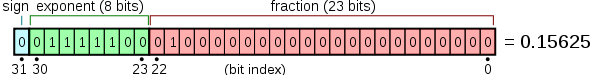

# go 数字类型
**导读：**
- int
- float
- complex
- issues

## int

int 是 go 语言的整数类型，一共分为下面这么几类

|类型|描述|
|:---:|:---:|
|int|有符号的整数类型，具体占几个字节要看操作系统的分配，不过至少分配给32位|
|uint|非负整数类型，具体占几个字节要看操作系统的分配，不过至少分配给32位|
|int8|有符号的整数类型，占8位bit，1个字节。范围从负的2的7次方到正的2的7次方减1|
|int16|有符号的整数类型，占16位bit，2个字节。范围从负的2的15次方到正的2的15次方减1|
|int32|有符号的整数类型，占32位bit，4个字节。范围从负的2的31次方到正的2的31次方减1|
|int64|有符号的整数类型，占64位bit，8个字节。范围从负的2的63次方到正的2的63次方减1|
|uint8|无符号的正整数类型，占8位，从0到2的8次方减1.也就是0到255|
|uint16|无符号的正整数类型，占16位，从0到2的16次方减1|
|uint32|无符号的正整数类型，占32位，从0到2的32次方减1|
|uint64|无符号的正整数类型，占64位，从0到2的64次方减1|
|uintptr|无符号整数类型。它大到足以容纳任何指针|
|rune|int32的别名，代表一个 UTF-8 字符|
|byte|uint8别名，代表了ASCII 码的一个字符|

go 使用 `'\x12'` 或者使用 `0x12` 来表示 16 进制

go 使用 `'\012'` 或者使用 `012` 来表示 8 进制

go 不能直接显示 2 进制，使用 `fmt.Printf("%b",12)` `1000` 来输出一个二进制
## float
|类型|描述|
|:---:|:---:|
|float32|浮点型，包括正负小数，IEEE-754 32位的集合，提供大约 6 个十进制数的精度，math.MaxFloat32 表示 float32 能取到的最大数值,math.SmallestNonzeroFloat32表示最小值|
|float64|浮点型，包括正负小数，IEEE-754 64位的集合，提供约 15 个十进制数的精度，math.MaxFloat64 表示 float64 能取到的最大数值,math.SmallestNonzeroFloat64表示最小值|

浮点数使用 `fmt.Printf("%.4f\n", math.Pi)`，`%.nf` 来控制保留几位小数

我们知道根据 IEEE 754 标准，使用有限个位置的二进制数字去代表无限个数字，那么必然是不精确的，是近似的。

由于浮点数计算的时候并不精确，容易发生较大误差，所以我们可以使用现有的高精度第三方库进行替换：https://github.com/shopspring/decimal

### 基础浮点数，math/big 包，decimal 三方包的对比

让我们看一下著名的 0.1 + 0.2 != 0.3 这个问题
```go
package main

import "fmt"

func main() {
	var a = 0.1
	var b = 0.2
	
	// false
	fmt.Println(a+b == 0.3)
}
``` 

***基础浮点数 IEEE 754 详细介绍***

这是一个 IEEE 754 的内部存储示意图，这个标准下，数字使用二进制的方式进行存储：



|sign|exponent|fraction|
|:---:|:---:|:---:|
|代表正负的符号位|指数位|尾数|

- sign：`(-1)^sign`，所以当 sign 等于 0 时，就是正数，当 sign 等于 1 时就是负数

- exponent：指数，也就是 2 的指数，在计算的时候，我们要减去一个偏移量 (127 或者 1023，这取决于 32 位还是 64 位)，在 32 位的情况下，0 - 255，然后减去偏移量 127，结果是：[-126,127] (正常情况下，不算上 00000000 和 11111111 这两种情况)

- fraction：尾数，表示为 1.fraction 或者 0。fraction 的样子，后者通常表示的极小浮点数

例如，图示的 0.15625，使用 IEEE 754 来表示：
```go
(-1)^0 * 2^1111100 * 1.01

= 2^(124 - 127) * 1.01

2^-3 * 1.01

= 0.00101（二进制）
= 0.15625 （十进制）
```
可以看到，一个十进制的 0.15625 要转化为一个 2 进制的信息进行保存，那么问题来了，为什么浮点数的 0.1 不等于整数的 0.1 呢？

> 10 进制小数转化为 2 进制：使用十进制的小数部分乘以 2，然后取整数部分，然后再把这个数的小数部分再次乘以 2... 直到小数部分为零结束；十进制的整数部分就按照普通的除法，每次都除以 2，然后取余数，直到商为 0：

>举一个例子：十进制 8.35；

> 整数部分是 8，8 /2 = 4 余 0，4/2 = 2 余 0，2/2 = 1 余 0，1/2=0 余 1，那么根据倒序排列来得出结果就是 1000；

> 小数部分是 0.35,0.35 *2 = 0.7 整数部分是 0,0.7* 2 = 1.4 整数部分是 1，0.4 *2 = 0.8 整数部分是 0,0.8* 2 = 1.6 整数部分是 1，0.6 *2 = 1.2 整数部分是 1，0.2* 2 = 0.4 整数部分是 0，0.4 *2 = 0.8 整数部分是 0，0.8*2 = 1.6 ... 那么小数部分就是 0.01011001... 那么在满足某个精度的情况下，它的值用二进制表示就是 1000.01011001；

> 将它还原也很简单，整数部分按照 2 的指数，小数部分按照 2 的负指数：1*2^3 + 2^-2 + 2^-4 + 2^-5 = 8.34375

第一步，我们需要将 0.1 转化为二进制，那么等于多少呢？

答案是：0.0001100110011...

看到了吧，除不尽啊，那么我们取它的尾数 1.1001100110011001100 * 2^-4

如果填入他们的图就是
- sign 为 0
- 指数的十进制为 -4 + 127 = 123，也就是 ` 1111011` 填入上面的内容就是 01111011
- 尾数是 100110011001100

所以你会发现从这里的存储再转化为 10 进制的结果就是

```go
2^-4 * 1.1001100110011

= 0.00011001100110011

= 0.0999984741210937
```
总结：由于某些数字，从 10 进制转化为 2 进制的时候，无法得到精确值，除不尽，所以，浮点数存储数字，有些数字不能精确存储

***math/big 包详细介绍***

big 拥有下面三个类型

- Int
- Float
- Rat (有理数)

big 包提供的 `big.Int` 底层数据是一个切片，所以说它可以保存超过 `uint64` 的数据；`big.Rat` 的底层数据是，分子和分母分别都是一个 `big.Int` 类型，所以说它也可以保存超过 uint64 的数据。

big.Float 类型是 Go 语言中提供的一个高精度的浮点数计算库，它使用了任意精度的浮点数表示，可以处理大数和小数，并提供了一系列的计算方法

虽然它是高精度的浮点数计算，但是仍然不够精确，如果是绝对的精确的浮点数计算，通常要使用有理数，或者使用整数去取代真正的小数，下面这个第三方包就是使用整数去取代浮点数的方式来获取精确的浮点数运行结果。

***decimal***

这个第三方包底层使用 `big.Int` 进行处理数据，也就是说，它使用整数存储，计算然后得出结论的时候再把之前的指数还原即可，所以它可以进行精确的浮点数运算

https://github.com/shopspring/decimal

这个包中，0.1 + 0.2 就等于 0.3 了
```go
func main() {
	// 创建一个新的Float类型
	a := decimal.NewFromFloat(0.1)
	b := decimal.NewFromFloat(0.2)
	c := decimal.NewFromFloat(0.3)
	value := a.Add(b)
	// 0
	fmt.Println(value.Cmp(c))
}
```

## complex 复数
|类型|描述|
|:---:|:---:|
|complex64|实部和虚部是 float32|
|complex128|实部和虚部都是 float64|

`c := complex(3, 4) ` 创建一个复数，实部为 3，虚部为 4

或者还可以这样：`c := 3 + 4i`

使用 go 语言内置的函数 `real()` 和 `imag()` 来分别获取到复数的实部和虚部
## issues
***问题一：***go 语言数字之间的类型转化是如何进行的

go 语言的类型转换是显性转化的，数字类型之间可以使用这种方法
```go
var i int
f := float64(i)
```
***问题二：***能说说 `uintptr` 和 `unsafe.Pointer` 的区别吗

- `unsafe.Pointer` 是通用指针类型，它不能参与计算
- `uintptr` 是指针运算的工具，但是它不能持有指针对象 (意思就是它跟指针对象不能互相转换)
- `unsafe.Pointer` 和 `uintptr` 可以相互转换，`unsafe.Pointer` 和指针对象可以相互转换，但是 `uintptr` 和指针对象不能相互转换
- unsafe.Pointer 是指针对象进行运算 (也就是 uintptr) 的桥梁

```go
package main

import (
	"fmt"
	"unsafe"
)

func main() {
	// 指针对象
	v := new(int)
	// 将指针对象转化为通用指针类型
	vp := unsafe.Pointer(v)
	// 将通用指针类型转换为指针对象
	vo := (*int)(vp)

	//将通用指针对象转化为uintptr
	uv := uintptr(vp)
	//将uintptr转换为通用指针对象
	vpp := unsafe.Pointer(uv)
	fmt.Println(v, vp, vo, uv, vpp)

	// 对指针对象的地址进行计算
	t := new(string)
	// 首先先将t转化为unsafe.Pointer类型
	pt := unsafe.Pointer(t)
	// 然后将pointer再转化为 uintptr
	rt := uintptr(pt)
	//进行计算
	npt := rt + uintptr(1)
  // 计算完毕后，再将uintptr转化为unsafe.Pointer再转换为*string类型
	nt := (*string)(unsafe.Pointer(npt))
	fmt.Println(t, pt, rt, npt, nt)
}

```

***问题三：***rune 和 byte 的区别

rune 是 int32，byte 是 uint8，相比 byte 来说，rune 可以容纳的字符个数要多很多，所以 utf8 编码的字符使用 rune，而 ascii 使用 byte，例如 ‘中’ byte 无法承受，“中” 转为 `[]byte` 的时候是 `[228 184 173]`，“中” 转换为 `[]rune` 则是等于 `[20013]` 因为 rune 可承受的数值更大，并且一个 utf8 的字符就等于一个 rune 的数值，如果是使用 ‘中’ 那默认就是 rune 类型

> unicode 是一种字符编码，让每个字符和一个数字对应起来，仅此而已，至于这个数字如何存储它就不管了。utf8 就是定义了如何具体存储这个编码数字的一种方法

## 参考资料
- https://zhuanlan.zhihu.com/p/145220416
- http://www.manongjc.com/article/50416.html
- http://c.biancheng.net/view/18.html
- https://zhuanlan.zhihu.com/p/353013671
- https://developer.aliyun.com/article/673258