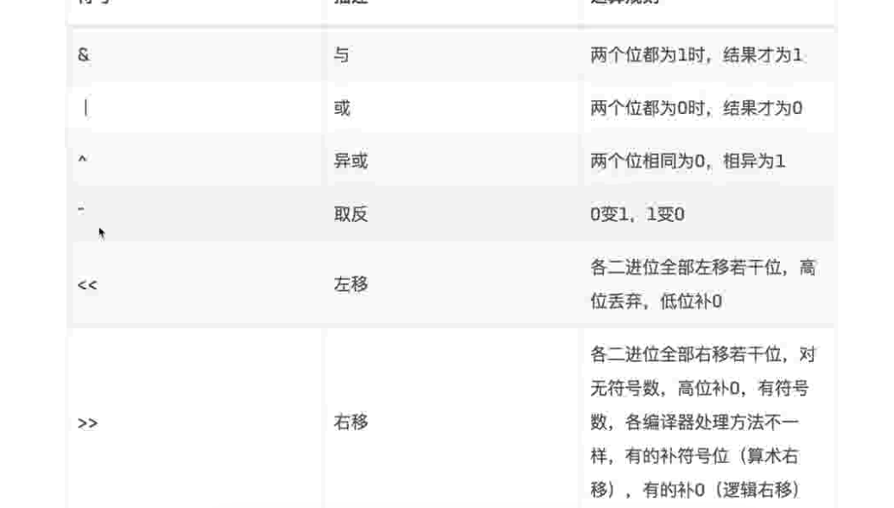

# 位运算
**能用位运算的，尽量用位运算，在日常不管是写代码或者是刷题的时候都得有这个意识，因为位运算真的可以极大的提高速度，以及减少代码的啰嗦程度
只不过有一个小小的缺点 --  垃圾程序员可能看不懂你的代码。**
## 位运算的基本操作
|符号|含义|
|:---:|:---:|
|`&`|两个位都是1，得1|
|`\|`|两个位都是0，得0|
|`^`|两个位不一样得1，一样是0|
|`～`|取反，0变1，1变0（go不支持，go使用 ^a）,如果是取负值就是 ^a +1|
|`<<`|整体向左移动n 等于 1x 2^n|
|`>>`|整体向右移动n 等于1 / 2 ^n|
|&^ |相当于先或再与，因为或是单运算符，等级高|

## 异或的几个技巧
- `x ^ 0 = 0`
- `x ^ 1s = -x` 1s 的意思是换算成2进制所有位数都是1
-  `x ^ x = 0`
- `a ^ b = c ` => `a ^c =b` + `b ^ c = a`
- `a ^ b ^ c = a ^ (b ^ c)`

## 位运算的几个技巧
- 除以2: n >>1
- 最小的int:  -n << 63
- 最大的int: n << 63 -1
- 奇数: **n&1 == 1**
- 偶数: n&1 != 1(语法糖：n % 2 == 0 这里底层调用的是位运算)
- a % b = a & (b-1)(**b=2^n** b必须符合这个才OK) 通用公式 
- **x & (x-1) 消除最低位的1**
- **x & -x 得到最低位的1所在的位置** 取负数就是取反然后+1 go中就是^a+1 ,也就是说go跟c只有一点不同 c是 ～a go是 ^a ; -x 这个负数哈市一个意思的。
## 位运算更复杂的几个技巧

