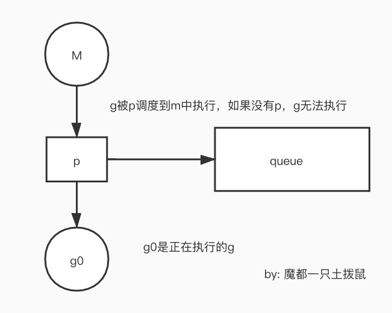

# G:P:M

这个模型是go的并发模型方案，其中M是machine P是上下文G是go的goruntine，
其中M是代表了machine同时也是代表了系统的线程，所以也就是说go的goruntine其实是用户级的微线程
然后每一个线程中都有很多P控制的goruntine，这些P是在系统运行前就确定的（就是那个设置的最大线程数量，通常跟系统保持一致）
然后再使用的过程中goruntine是可变的，这就可以使用一个小小的goruntine就可以开启一个新的微线程上下文，大大降低了颗粒度，同时
也可以创建出大量的goruntine。所以go的并发效果是非常好的，同时在最新的go中也是支持并行的，只要计算机的cpu支持多核，go就会自动开启
并行这个机制。我们通常可以使用跟内核相同的数量的p然后每个p中有一个goruntine，把这些数据分开进行计算，这个时候就是并行计算，
然后到最后汇总结果即可。

通常来说每个p下面都有一个g0和一个队列，假如g0被执行的时候m被收回了，这个时候g0就会被放入到全局队列中，所以每一个p都会定期去检查
全局队列是否有值，如果自己队列中的g被执行完毕了就会去抢夺其它的p执行的队列，而且是每次一半。

go中的goruntine之间的通信是靠的chan 类似linux中的通道，初始值是nil这就意味着它是引用类型。要用make来初始化。

p把g拉到m中执行
## 抛妻弃子
当某个m阻塞了以后，p就会带着剩下的的队列中的g（被执行的g也被阻塞了，所以也被抛弃了）去投奔一个新的没有阻塞的m

然后这个被阻塞的g和m，g放到全局的queuem放到m池中。等待被再次唤醒。

