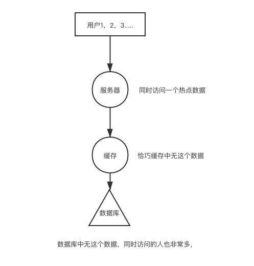

# 缓存雪崩的问题

在说明这几种情况的前提下说一下，任何使用了缓存的系统都要面临着数据一致性的问题，就算是再快的缓存也有可能跟数据库中的实际数据不一致，
所以说如果一个场景下的实际的数据要求一致性超级高，就别用缓存了。

雪崩的问题是 大面积的商品都过期了。


## 如何解决？

### 解决方法一 添加一个随机数

```go
// 伪代码
setRedisTime(time+random) // 时间+随机值
```
 我们都是设置不同商品的时候+一个随机数，那么数据库的压力就会小很多，这样就可以去避免雪崩的问题了。
### 解决方法二

我们可以将这个缓存设置为永不过期。

# 缓存击穿问题

## 如何解决

### 设置永不过期

我们可以在用户少的情况下更新这个缓存，然后设置这个缓存永不过期就OK了，比如在双十一来临的前5个小时更新了这个数据，然后设置缓存就不停止了，直到双十一过完。

### 设置互斥锁

我们将从缓存中查询不到数据开始谁知一个lock，然后直到更新完缓存中的数据结束锁开。这样只能有一个用户去进行缓存数据更新这个操作了。自然数据库的压力就小了

```go
if 缓存中没有数据{
  if 可以锁住 {
    去数据库中获取数据
   更新缓存
   开锁  
  }else{
  100ms后再次去查询缓存。  
  }
}
```
如果在一个用户去获取数据库值并且充盈到redis的时候，另一个请求也来请求这个key，那么这个key直接返回的结果就是空，因为这个key你是先在redis中创建，然后去取值，那这个刚被创建的key对应的就是空呗。

# 缓存穿透问题

## 如何解决？

### 返回一个空值（可以是1 2 bool啥的这种值）

我们其实应该把这个不存在的key也记录到缓存中，然后我们可以将这些有攻击倾向的key值设置一个比较短的过期时间。比如60秒
这样我们的数据库就不会被拖垮了。但是这种办法有个问题，假设，有很多这种k，那么你的缓存中就会充盈了很多这种空值的值，
如果缓存例如redis吧，你的主机内存很小，那么就会造成缓存的负担，进而降低真实的值，所以一定要权衡缓存的大小。
```go
// 伪代码
if _,ok := map[k];!ok {
  setRedis(k,1,60s)// 将这个值不要忽略，设置的过期时间短一点即可。
}
```
### 布隆过滤器
布隆过滤器是由一个哈希函数+一个二进制的数组
```go
//  伪代码
i := hashFuction1(key)
i1 := hashFuction2(key)
i2 := hashFuction3(key)
type v struct {
  value []uint
}
v.value[i] = 1
v.value[i1]= 1
v.value[i2] = 1
//

if v.vaue[hashfunc(k)] ==0||v.vaue[hashfunc1(k)] == 0|| v.vaue[hashfunc3(k)] ==0{
  // 这个k就不存在这个缓存中。因为布隆过滤器是可能存在，那么如果是0就是一定不存在。
}
```
使用布隆过滤器看查看数据是否存在，这个时候要使用redis的bitmap了，用这种方法来判断数据是否存在（可能存在）那么一定不存在的就不需要理会了，
可能存在的再去查询redis的数据，这个时候应该大部分都是准确的，如果不准确再去查看数据库即可，反正量肯定不大。
