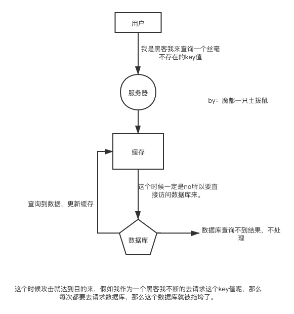

# 缓存雪崩的问题

在说明这几种情况的前提下说一下，任何使用了缓存的系统都要面临着数据一致性的问题，就算是再快的缓存也有可能跟数据库中的实际数据不一致，
所以说如果一个场景下的实际的数据要求一致性超级高，就别用缓存了。


## 如何解决？

我们来分析一下：关键的地方就是又一批人很点背在刚好失效的时间点的前一个小时（11点）访问了数据，一大波人不受影响例如3号，她就无所谓
那么我们只需要将1 2 这种点背的人处理一下就OK了。

### 解决方法一 添加一个随机数

```go
// 伪代码
setRedisTime(time+random) // 时间+随机值
```
 我们让所有人都是设置的时候+一个随机数，这样只有11点并且随机数是0的超级大点背的人才会去访问数据库，那么数据库的压力就会小很多，这样就可以去避免雪崩的问题了。

### 布隆过滤器

### 添加二级缓存

### 阻塞队列

### 自旋锁


# 缓存击穿问题

# 缓存穿透问题

## 如何解决？
我们其实应该把这个不存在的key也记录到缓存中，然后我们可以将这些有攻击倾向的key值设置一个比较短的过期时间。比如60秒
这样我们的数据库就不会被拖垮了。
```go
// 伪代码
if _,ok := map[k];!ok {
  setRedis(k,1,60s)// 将这个值不要忽略，设置的过期时间短一点即可。
}
```
