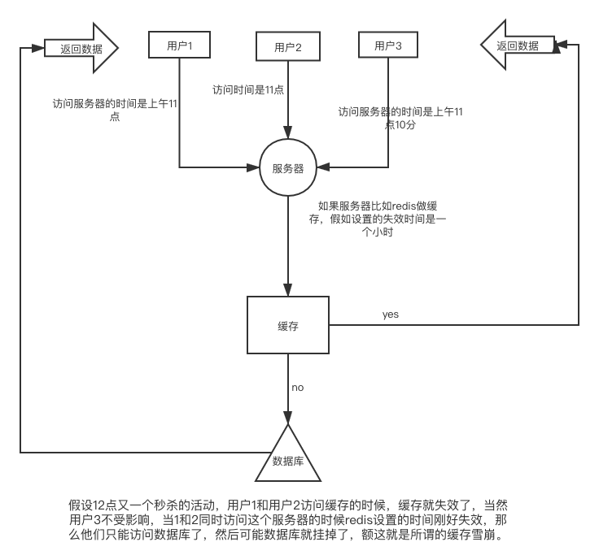

# 缓存雪崩的问题



## 如何解决？

我们来分析一下：关键的地方就是又一批人很点背在刚好失效的时间点的前一个小时（11点）访问了数据，一大波人不受影响例如3号，她就无所谓
那么我们只需要将1 2 这种点背的人处理一下就OK了。

```go
// 伪代码
setRedisTime(time+random) // 时间+随机值
```
 我们让所有人都是设置的时候+一个随机数，这样只有11点并且随机数是0的超级大点背的人才会去访问数据库，那么数据库的压力就会小很多，这样就可以去避免雪崩的问题了。
