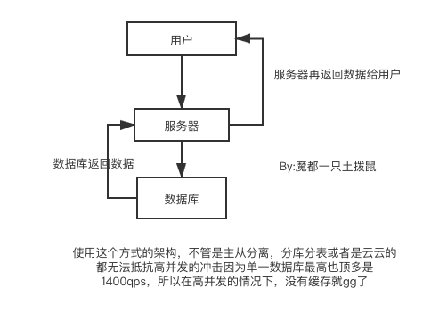

# 什么是缓存？
## 一般的系统


## 拥有缓存的系统

## 缓存的定义
任何两种硬件之间相差很大的速度，就可以说a是b的缓存。
常见的缓存有内存，当然或者是ssd。缓存并不等于内存。因为内存实在是太小了，同样的大小ssd比内存便宜太多了，所以有时候使用ssd当缓存可以极大的扩充容量。

下面是各种硬件之间的速度差距

## 缓存的几个案例
1. 快手等小视频的播放

这些视频往往都是预加载，往往在打开第一个视频的时候再往下看的几个视频已经被下载好了，所以我们才觉得秒开，这一点要吐槽一下微博，微博之前的缓存做的并不好，往往导致下一个视频不能秒开，不过近期倒也是OK了。

2. HTTP协议
有没有发现其实你第一次打开网页，各种资源非常慢，然后当第二次打开的时候就飞快，这其实就是http协议对某些资源作为缓存，也就是说它判断第二次跟第一次的一样，就把第一次的先存起来的数据给到了第二次中。

这个过程是这样的：
```go
1. 浏览器接受http协议传过来的etag：123字段，然后将资源和字段记录在一起
2. 当第二次打开的时候http协议发送if-none-match：123 服务器判断出来这个是缓存，那么服务器就直接返回304的状态码。
3. 这个时候浏览器就直到其实是一个东西，那么它就不需要去请求资源然后直接那缓存即可。
```
### 什么是缓存区

缓存是为了减少对速度慢的储存机构的压力而设置的一个用空间换时间的工具，而缓存区的意思跟缓存很像，但是功能不同，它的作用是加快数据存入数据库的时间，例如数据先储存在一个消息队列中，那么操作系统就会将这个数据块设置为“脏”然后设置一个阈值，然后使用一个协程或者线程将数据导入到真正的数据库中。这就是缓存区的概念，跟缓存很像，但是功能是有差异的。一个是为了解决访问速度问题，一个是为了解决储存问题。
## 缓存的分类
1. 静态缓存

所谓静态就例如说一个被渲染好的静态html，嗯这就是，当pv很大的网站例如新浪等门户网站，某些静态的不需要动态的资源例如文章就没有必要放入到数据库中，直接放到nginx下就行，这个时候访问的时候不需要去查询数据库，访问的速度贼快，但是它不能搞动态啊（其实想想真的动态的东西也不多，有些特定的时候还是静态的多，所以如果是这个场景下，直接生成html是最快的，不要放数据库中）

2. 分布式缓存
//todo
例如使用redis可以做一个集群[【传送门】](#)

3. 热点本地缓存
核心就是把数据直接放服务器中，就是不需要服务器去缓存或者数据库中取数据了，直接写死在服务器中，那速度当然快了，这个场景主要是例如某个热点及其的集中，如果访问这个点所在的缓存或者数据库及其大的访问量，那么就会挂（参考微博某某明星出轨）所以说这个时候直接把他的数据写到服务器中就不会挂了（因为服务器可以搞很多台集群一下），由于本地缓存是部署在应用服务器中，而我们应用服务器通常会部署多台，当数据更新时，我们不能确定哪台服务器本地中了缓存，更新或者删除所有服务器的缓存不是一个好的选择，所以我们通常会等待缓存过期。因此，这种缓存的有效期很短，通常为分钟或者秒级别，以避免返回前端脏数据。
常见的热点本地储存例如说hashmap就是，意思即使直接储存在服务器中的。
## 缓存的优势和劣势
- 优势很明显啦，那就是快啊，这既是空间换时间的方法
- 缺点也很多啦，贵，不能所有都加缓存（只能热点信息）系统变得复杂了，数据不一致风险加大，占用资源。
## 多维度缓存系统。

## 如何提高缓存的命中率
- 可以使用布隆过滤器
- 从内存换成ssd，加大缓存的量。
